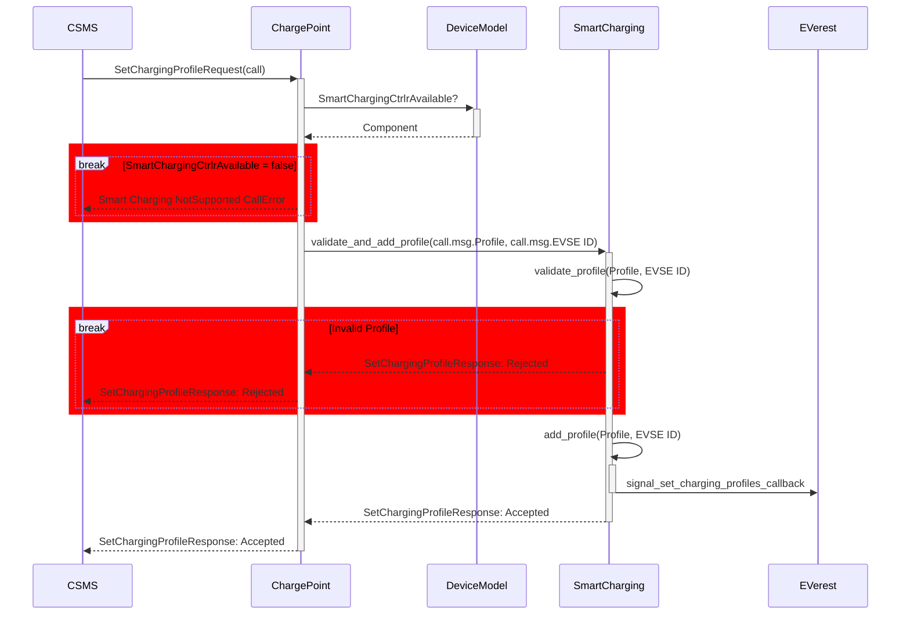
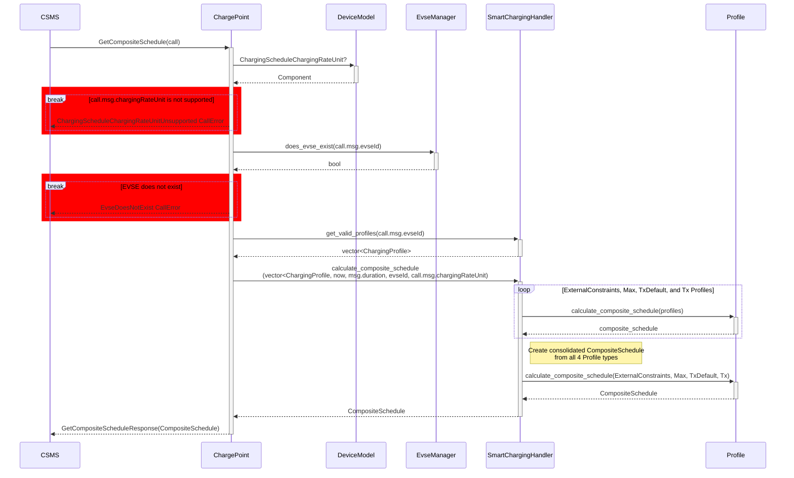
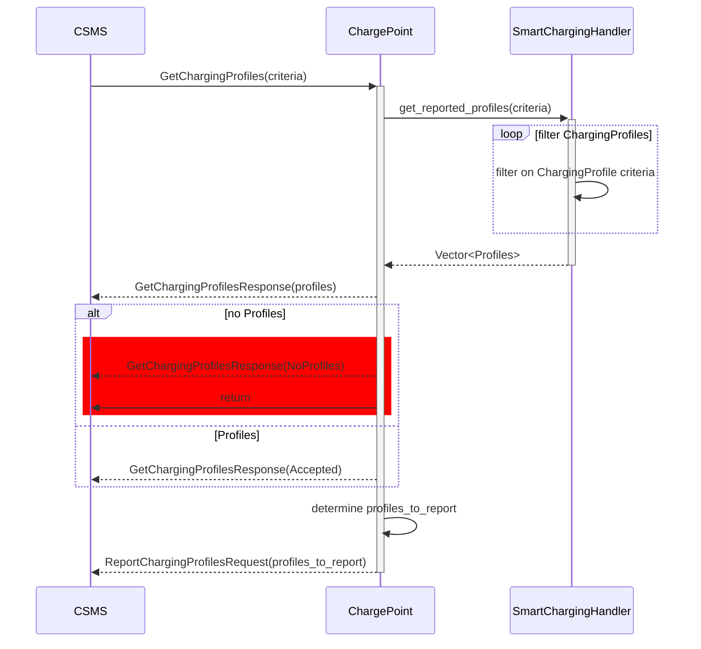
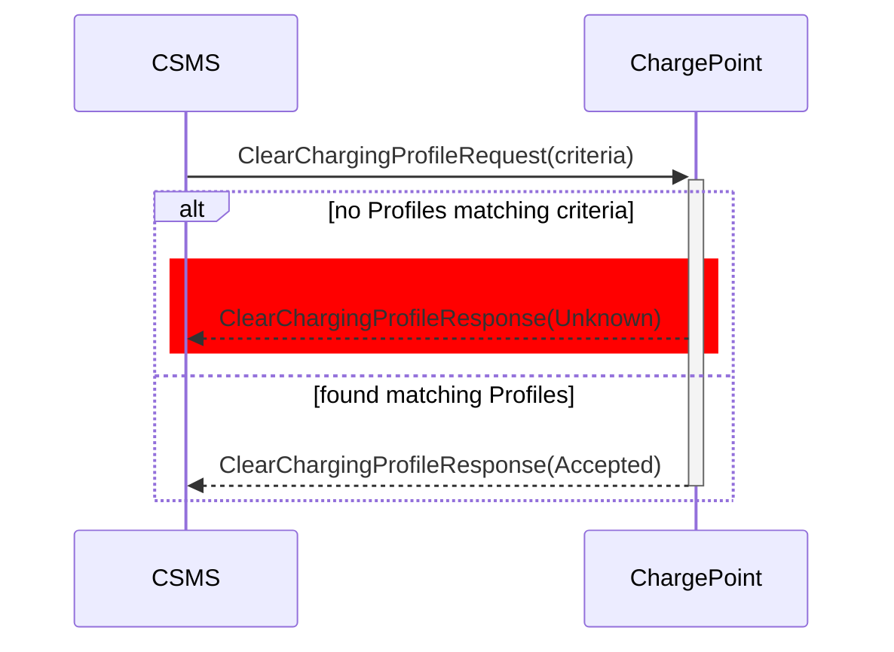

# C++ implementation of OCPP 2.0.1


This is a C++ library implementation of OCPP for version 2.0.1
(see [OCPP protocols at OCA website](https://openchargealliance.org/protocols/open-charge-point-protocol/)).

It enables charging stations to communicate with cloud backends for remote
control, monitoring and billing of charging processes.

Libocpp can be used for the communication of one charging station and multiple EVSE using a single websocket connection.

The implementation of OCPP 2.0.1 is currently under development.

## Get Involved

See the [COMMUNITY.md](https://github.com/EVerest/EVerest/blob/main/COMMUNITY.md) and [CONTRIBUTING.md](https://github.com/EVerest/EVerest/blob/main/CONTRIBUTING.md) of the EVerest project to get involved.

## Table of contents

- [Support for OCPP 2.0.1](#support-for-ocpp-201)
  - [Feature Profile Support OCPP 2.0.1](#feature-profile-support-ocpp-201)
- [CSMS Compatibility OCPP 2.0.1](#csms-compatibility-ocpp-201)
- [Run OCPP2.0.1 with EVerest](#run-ocpp201-with-everest)
- [Integrate this library with your Charging Station Implementation for OCPP2.0.1](#integrate-this-library-with-your-charging-station-implementation-for-ocpp201)
  - [Register event callbacks and on\_handlers](#register-event-callbacks-and-on_handlers)
  - [Initialize the database](#initialize-the-database)
- [Install libocpp](#install-libocpp)
- [Quickstart for OCPP 2.0.1](#quickstart-for-ocpp-201)
- [Building the doxygen documentation](#building-the-doxygen-documentation)
- [Unit testing](#unit-testing)
- [Building with FetchContent instead of EDM](#building-with-fetchcontent-instead-of-edm)

## Support for OCPP 2.0.1

The development of OCPP2.0.1 is in progress. 
[Current implementation status.](/doc/ocpp_201_status.md)

### Feature Profile Support OCPP 2.0.1

| Feature Profile            | Supported                 |
| -------------------------- | ------------------------- |
| Core                       | :heavy_check_mark: yes    |
| Advanced Security          | WIP                       |
| Local Auth List Management |                           |
| Smart Charging             | WIP                       |
| Advanced Device Management |                           |
| Advanced User Interface    |                           |
| Reservation                |                           |
| ISO 15118 support          | WIP                       |

| Whitepapers & Application Notes                                                                                                                              | Supported              |
| ----------------------------------------------------------------------------------------------------------------------------------------- | ---------------------- |
| [OCPP & California Pricing Requirements](https://www.openchargealliance.org/uploads/files/ocpp_and_dms_evse_regulation-v2.0.pdf)          | WIP                    |


## CSMS Compatibility OCPP 2.0.1

The current, ongoing implementation of OCPP 2.0.1 has been tested against a
few CSMS and is continuously tested against OCTT2.

Additionally, the implementation has been tested against those CSMS:

- [CitrineOS](https://lfenergy.org/projects/citrineos/)
- Chargepoint
- Current
- ihomer (Infuse CPMS)
- Instituto Tecnológico de la Energía (ITE)
- [MaEVe (Thoughtworks)](https://github.com/thoughtworks/maeve-csms)
- [Monta](https://monta.com)
- [Open Charging Cloud (GraphDefined)](https://github.com/OpenChargingCloud/WWCP_OCPP)
- Switch EV
- SWTCH

## Run OCPP2.0.1 with EVerest

This library is automatically integrated as the OCPP and OCPP201 module within [everest-core](https://github.com/EVerest/everest-core) - the complete software stack for your charging station. It is recommended to use EVerest together with this OCPP implementation.

If you run libocpp with OCPP1.6 with EVerest, the build process of [everest-core](https://github.com/EVerest/everest-core) will take care of installing all necessary dependencies for you. This includes the initialization of the device model database using the [config.json](config/v201/config.json) file.

## Integrate this library with your Charging Station Implementation for OCPP

OCPP is a protocol that affects, controls and monitors many areas of a charging station's operation.

If you want to integrate this library with your charging station implementation, you have to register a couple of **callbacks** and integrate **event handlers**. This is necessary for the library to interact with your charging station according to the requirements of OCPP.

Libocpp needs registered **callbacks** in order to execute control commands defined within OCPP (e.g Reset.req or RemoteStartTransaction.req)

The implementation must call **event handlers** of libocpp so that the library can track the state of the charging station and trigger OCPP messages accordingly (e.g. MeterValues.req , StatusNotification.req)

Your reference within libocpp to interact is a single instance to the class [ChargePoint](include/ocpp/v16/charge_point.hpp) for OCPP 1.6 or to the class [ChargePoint](include/ocpp/v201/charge_point.hpp) for OCPP 2.0.1.

### Overview of the required callbacks and events and what libocpp expects to happen

The following section will give you a high level overview of how to integrate libocpp with your application. Please use the [Doxygen Documentation](#building-the-doxygen-documentation) as an additional source for the ChargePoint API.

In EVerest the OCPP module leverages several other modules to perform tasks that relate to authorization, reservations, charging session handling and system tasks like rebooting or firmware updates.

- Auth orchestrates authorization, utilizing different token providers like RFID reads and token validators. Libocpp mainly acts as a token validator, but in the case of RemoteStartTransactions it acts as a token provider as well
- EvseManager manages the charging session and charging state machine by communicating with a "board support package", a driver for the charging hardware that abstracts away the control pilot, relay control, power meters, etc. The EvseManager also handles reservations.
- System handles firmware updates, log uploads and resets

The following sections explain the steps you can follow to implement their functionality on your own and integrate the libocpp directly into your charging station software without relying on EVerest. However, in most cases it's much easier to write an EVerest driver using the *everest-core/interfaces/board_support_AC.yaml* interface.

## Usage for OCPP 2.0.1

### Smart Charging

Work to fully support OCPP 2.0.1 Smart Charging is ongoing. Most functional requirements for General Smart Charging use cases (that is, K01–K10) are now supported. For an up-to-date overview of which features are currently supported, please refer to the [OCPP 2.0.1 Status](doc/ocpp_201_status.md) document.

#### K01 SetChargingProfile

Allows the CSMS to influence the charging power or current drawn from a specific EVSE or the
entire Charging Station over a period of time.



Profile validation returns the following errors to the caller when a Profile
is `Rejected`:

- `ChargingProfileFirstStartScheduleIsNotZero`

  The `startPeriod` of the first `chargingSchedulePeriod` needs to be 0.
  [K01.FR.31]

- `ChargingProfileNoChargingSchedulePeriods`

  Happens when the `ChargingProfile` doesn't have any Charging Schedule
  Periods.

- `ChargingScheduleChargingRateUnitUnsupported`

  Happens when a chargingRateUnit is passed in that is not configured in the
  `ChargingScheduleChargingRateUnit`. [K01.FR.26]

- `ChargingSchedulePeriodInvalidPhaseToUse`

  Happens when an invalid `phaseToUse` is passed in.
  
  [K01.FR.19] [K01.FR.48]

- `ChargingSchedulePeriodPhaseToUseACPhaseSwitchingUnsupported`

  Happens when phaseToUse is passed in and the EVSE does not have
  `ACPhaseSwitchingSupported` defined and set to true.
  [K01.FR.20] [K01.FR.48]

- `ChargingSchedulePeriodsOutOfOrder`

  `ChargingSchedulePeriod.startPeriod` elements need to be in increasing
  values. [K01.FR.35]

- `ChargingStationMaxProfileCannotBeRelative`

  Happens when a `ChargingStationMaxProfile.chargingProfileKind` is set to
  `Relative`. [K01.FR.38]

- `ChargingStationMaxProfileEvseIdGreaterThanZero`  

  Happens when a `ChargingStationMaxProfile` is attempted to be set with an
  EvseID isn't `0`. [K01.FR.03]

- `ChargingProfileMissingRequiredStartSchedule`

  Happens when an `Absolute` or `Recurring` `ChargingProfile` doesn't have
  a `startSchedule`. [K01.FR.40]

- `ChargingProfileExtraneousStartSchedule`

   Happens when a Relative `ChargingProfile` has a `startSchedule`.
   [K01.FR.41]

- `EvseDoesNotExist`

  Happens when the `evseId`of a `SetChargingProfileRequest` does not exist.
  [K01.FR.28]

- `ExistingChargingStationExternalConstraints`
  
  Happens when a `SetChargingProfileRequest` Profile has a purpose of
  `ChargingStationExternalConstraints` and one already exists with the same
  `ChargingProfile.id` exists. [K01.FR.05]

- `InvalidProfileType`

  Happens when a `ChargingStationMaxProfile` is attempted to be set with a
  `ChargingProfile` that isn't a `ChargingStationMaxProfile`.

- `TxProfileEvseHasNoActiveTransaction`

  Happens when a `SetChargingProfileRequest` with a `TxProfile` is submitted
  and there is no transaction active on the specified EVSE. [K01.FR.09]

- `TxProfileEvseIdNotGreaterThanZero`
  
  `TxProfile` needs to have an `evseId` greater than 0. [K01.FR.16]

- `TxProfileMissingTransactionId`
  
  A `transactionId` is required for  `SetChargingProfileRequest`s with a
  `TxProfile` in order to match the profile to a specific transation. [K01.FR.03]

- `TxProfileTransactionNotOnEvse`
  
  Happens when the provided `transactionId` is not known. [K01.FR.33]

- `TxProfileConflictingStackLevel`

  Happens when a `TxProfile` has a `stackLevel` and `transactionId`
  combination already exists in a `TxProfile` with a different id in
  order to ensure that no two charging profiles with same stack level and
  purpose can be valid at the same time. [K01.FR.39]

#### K08 Get Composite Schedule

The CSMS requests the Charging Station to report the Composite Charging
Schedule, as calculated by the Charging Station for a specific point of
time, and may change over time due to external causes such as local
balancing based on grid connection capacity and EVSE availablity.

The Composite Schedule is the result of result of merging the time periods
set in the `ChargingStationMaxProfile`, `ChargingStationExternalConstraints`,
`TxDefaultProfile` and `TxProfile` type profiles.



#### K09 Get Charging Profiles

Returns to the CSMS the Charging Schedules/limits installed on a Charging Station based on the 
passed in criteria.



#### K10 Clear Charging Profile

Clears Charging Profiles installed on a Charging Station based on the
passed in criteria.



### Register event callbacks and on_handlers

- `all_connectors_unavailable_callback`

  Notifies that all connectors are unavailable. Used to handle charge availability
  requests and firmware updates.

- `boot_notification_callback`

  Callback to notify of a system boot

- `clear_customer_information_callback`

  Called to clear customer information based on passed in Customer Certificate, the
  IdToken for this request, and the Customer Identified that the request refers to.
  If IdToken is passed in will delete authorization cache entry from database.

- `configure_network_connection_profile_callback`

  Called to configure a network connection profile when none is configured.

- `connector_effective_operative_status_changed_callback`

  Notifies the user of liboccp that the Operative/Inoperative state of a specific EVSE
  has changed.

- `cs_effective_operative_status_changed_callback`

  Used to notify the user of libocpp that the Operative/Inoperative state of the
  charging station itself has changed. Will also call
  `evse_effective_operative_status_changed_callback` for each EVSE, and
  `connector_effective_operative_status_changed_callback` for each connector whose
  status has changed.

- `data_transfer_callback`

  Used to handle arbitrary data transfers.

- `evse_effective_operative_status_changed_callback`

  Notifies the user of libocpp that the Operative/Inoperative state of an EVSE has
  changed. If as a result the state of connectors changed as well, libocpp will
  additionally call the connector_effective_operative_status_changed_callback for
  each connector.

- `get_customer_information_callback`

  Returns human readable customer information based on the CertificateHashDataType,
  IdToken and Customer Identifier passed in.

- `get_log_request_callback`

  Callback to return logs

- `is_reservation_for_token_callback`

  Check if the current reservation for the given evse id is made for the id
  token / group id token.

- `is_reset_allowed_callback`

  Callback if reset is allowed. If evse_id has a value, reset only applies
  to the given evse id. If it has no value, applies to complete charging station.

- `ocpp_messages_callback`

  Callback to congfigure ocpp message logging.

- `pause_charging_callback`

  Used to request pausing of charging, the "connector" parameter instructing which
  connector/EVSE to pause.

- `remote_start_transaction_callback`

  Called when the request can be accepted. The boolean authorize_remote_start
  indicates if Authorize.req needs to follow or not

- `reset_callback`

  Performs a reset of the requested type

- `security_event_callback`

  Used to react to a security event callback. This callback is
  called only if the SecurityEvent occured internally within libocpp.
  Typically this callback is used to log security events in the security log.

- `set_charging_profiles_callback`

  Indicates when a charging profile is received and accepted.

- `stop_transaction_callback`

  Used to stop a transaction. Called when the idTagInfo.status of a
  StartTransaction.conf is not Accepted, when a RemoteStopTransaction.req is
  received, or when an UnlockConnector.req is received.

- `time_sync_callback`

  Called on boot notification if the TimeSource ControllerComponent contains
  Heartbeat.

- `transaction_event_callback`

  Called when a transaction_event was sent to the CSMS.

- `transaction_event_response_callback`

  Called when a transaction_event_response was received from the CSMS.

- `unlock_connector_callback`

  Used by libocpp to force unlock a connector

- `update_firmware_request_callback`

  Initiates a firmware update request. Triggers a security event notification
  if the certificate is Invalid or Revoked.

- `validate_network_profile_callback`

  Validates the submitted Network Profile. Is Rejected if
  - No callback registered to validate network profile
  - CSMS attempted to set a network profile with a lower securityProfile
  - CSMS attempted to set a network profile that could not be validated
  - Network profile could not be written to the device model storage

- `variable_changed_callback`

  Called when a variable has been changed by the CSMS

### Initialize the database

- Use provided sql database or implement your own storage drive

## Install libocpp

For Debian GNU/Linux 11 you will need the following dependencies:

```bash
  sudo apt install build-essential cmake python3-pip libboost-all-dev libsqlite3-dev libssl-dev
```

OpenSSL version 3.0 or above is required.

Clone this repository.

```bash
  git clone https://github.com/EVerest/libocpp
```

In the libocpp folder create a folder named build and cd into it.
Execute cmake and then make install:

```bash
  mkdir build && cd build
  cmake ..
  make install
```

## Quickstart for OCPP 2.0.1

Libocpp provides a small standalone OCPP2.0.1 client that you can control using command line.

Install the dependencies and libocpp as described in [Install libocpp](#install-libocpp).

Make sure you modify the following config entries in the [config.json](config/v201/config.json) file according to the CSMS you want to connect to before executing make install.

```json
{
  "Internal": {
    "ChargePointId": "",
    "CentralSystemURI": ""
  }
}
```

Change into libocpp/build and execute cmake and then make install:

```bash
  cd build
  cmake -DLIBOCPP16_BUILD_EXAMPLES=ON -DCMAKE_INSTALL_PREFIX=./dist ..
  make -j$(nproc) install
```

Use the following command to start the charge point. Replace the config with [config-docker.json](config/v16/config-docker.json) if you want to test with the [SteVe](https://github.com/steve-community/steve#docker) CSMS running in a docker container.

```bash
  ./dist/bin/charge_point \
    --maindir ./dist \
    --conf config.json
```

Type `help` to see a list of possible commands.

## Building the doxygen documentation

```bash
  cmake -S . -B build
  cmake --build build --target doxygen-ocpp
```

You will find the generated doxygen documentation at:
`build/dist/docs/html/index.html`

The main reference for the integration of libocpp for OCPP2.0.1 is the ocpp::v201::ChargePoint class defined in libocpp/include/ocpp/v201/charge_point.hpp .

## Unit testing

GTest is required for building the test cases target.
To build the target and run the tests you can reference the script `.ci/build-kit/install_and_test.sh`.
The script allows the GitHub Actions runner to execute.

Local testing:

```bash
mkdir build
cmake -B build -DBUILD_TESTING=ON -DCMAKE_BUILD_TYPE=Debug -DCMAKE_INSTALL_PREFIX="./dist"
cd build
make -j$(nproc) install
```

Run any required tests from build/tests.

## Building with FetchContent instead of EDM

In [doc/build-with-fetchcontent](doc/build-with-fetchcontent) you can find an example how to build libocpp with FetchContent instead of EDM.

### Support for TPM keys

In order to use the TPM keys, it is mandatory to use the default libwebsocket implementation.

## Support for websocket++

The old websocket++ implementation has been deprecated. For enabling websocket++ support use the following cmake option:

```bash
  cmake .. -DLIBOCPP_ENABLE_DEPRECATED_WEBSOCKETPP=ON
```

### Support for iface

In order to connect through a custom network iface, a custom internal config variable 'IFace' can be used.

```json
"Internal": {        
    "IFace" : "enp43s0"
}
```
