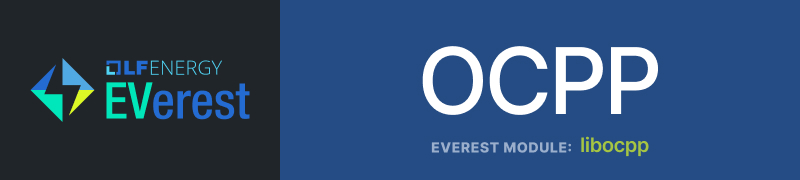

---

# EVerest OCPP Module (`libocpp`)

EVerest's Open Charge Point Protocol (OCPP) modules are based on this library—`libocpp`—a standalone C++ library implementing client-side OCPP 1.6 and 2.0.1 communications. This library can be used independently of EVerest to enable OCPP communication for a charging station.
 

### What is OCPP?

[OCPP](https://en.wikipedia.org/wiki/Open_Charge_Point_Protocol) is an open standard for communication between EV charging stations and central management systems. Developed by the [Open Charge Alliance (OCA)](https://openchargealliance.org/), OCPP ensures interoperability among various charging station manufacturers and management systems, playing a vital role in the EV charging ecosystem.

## Table of Contents

| [OCPP 2.0.1](/doc/ocpp_201_README.md) – Under active development :construction: | [OCPP 1.6](/doc/ocpp_16_README.md) – Complete implementation :white_check_mark: |
|------------|----------|
| • [Quickstart Guide](/doc/ocpp_201_README.md#quickstart-for-ocpp-201) | • [Quickstart Guide](/doc/ocpp_16_README.md#quickstart-for-ocpp-16) |
| • [Build and Install libocpp](/doc/ocpp_201_README.md#build-and-install-libocpp) | • [Build and Install libocpp](/doc/ocpp_16_README.md#build-and-install-libocpp) |
| • [Functionality Support](/doc/ocpp_201_README.md#integration-with-everest) | • [Functionality Support](/doc/ocpp_16_README.md#functionality-support) |
| • [Integration with EVerest](/doc/ocpp_201_README.md#integration-with-everest) | • [Integration with EVerest](/doc/ocpp_16_README.md#integration-with-everest) |
| • [Standalone Integration](/doc/ocpp_201_README.md#standalone-integration) | • [Standalone Integration](/doc/ocpp_16_README.md#standalone-integration) |
| • [Unit testing](doc/ocpp_201_README.md#unit-testing) | • [Unit testing](doc/ocpp_16_README.md#unit-testing) |
| • [CSMS Compatibility](/doc/ocpp_201_README.md#csms-compatibility) | • [CSMS Compatibility](/doc/ocpp_16_README.md#csms-compatibility) |

## Get Involved

We welcome contributions from the community! Whether you're interested in adding features, fixing bugs, or improving documentation, your help is valuable. Check out our [CONTRIBUTING.md](https://github.com/EVerest/EVerest/blob/main/CONTRIBUTING.md) guide to get started.

For more information on how to engage with the EVerest community, please refer to our [COMMUNITY.md](https://github.com/EVerest/EVerest/blob/main/COMMUNITY.md) document.

Together, we can drive the future of EV charging infrastructure!
