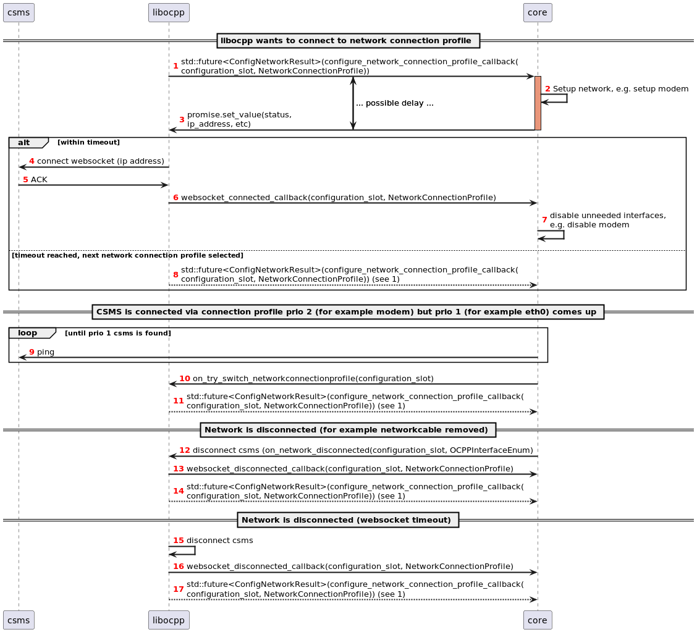

# Network connection profile interface

libocpp automatically tries to connect with the given network connection profiles. However, if you want to have more 
control, you can use the callbacks that are designated for the network connectivity.

libocpp will connect automatically with the network profile of the highest priority. If that does not succeed, it will 
move on to the network profile with the second highest priority, etc. 

## Set up interface (optional)

A callback can be implemented to be able to set up the interface. For example if the interface is a modem, it must first 
be enabled before it is possible to connect to that interface. To be able to do this, you can implement the callback   
`std::future<ConfigNetworkResult>(configure_network_connection_profile_callback(configuration_slot, NetworkConnectionProfile))`

In the implementation of this callback, you have to create a promise and return the future to the promise:
```cpp
std::promise<ocpp::v201::ConfigNetworkResult> promise();
std::future<ocpp::v201::ConfigNetworkResult> future = promise.get_future();
return future;
```

If the network was setup successfully, you can set the values in the future with 
```cpp
future.set_value(configNetworkResult);
```
This way libocpp knows it can connect with the given interface and try to do that. A timeout can be configured // TODO which timeout etc???
to be sure libocpp will not wait forever to connect.


### Bind to a specific interface

In some cases, there are multiple network interfaces available and you might want to connect to a specific interface.
In `ConfigNetworkResult` you can set the interface you want the websocket to bind to. Sometimes an interface has more
than one IP address (in the case of a link local / auto IP address for example). In that case you want the websocket
to bind to a specific IP address. The `interface_address` in ConfigNetworkResult supports both. It will bind using the
given network interface (a string containing the name of the interface) or the given ip address (a string containing 
the ip address in human readable format).


## Connect to higher network connection profile priority (optional)

Normally, if libocpp is connected with a network connection profile, it will not disconnect. But a situation might
occur that libocpp is connected with a profile with priority 2 or lower and you find out on system level that an 
interface (with a higher priority) changed and is now up. In that case you might want to inform libocpp that the higher
priority interface is up and that it can try to connect with that interface. For example when the modem has 2nd priority,
but you want to avoid high costs because of the data rates and switch back to wired network as soon as it is available.
A call is implemented exactly for this reason:  
`bool on_try_switch_network_connection_profile(const int32_t configuration_slot)`.  
When you call this function, you inform libocpp that there is a network connection profile available and it might try 
to connect to that network connection profile (when indeed the priority of that profile is higher and there might
be some more checks).  

Note: make sure to not ask for switching to another network profile too often, if it turns out that it can not connect
to the backoffice while there is a link available, there might be an 'unstable' connection to the backoffice.


## Disconnected / connected callbacks

libocpp provides two callbacks for when the websocket is connected and disconnected. It will provide the network slot
in those callbacks, so you can keep the used network connection up and running (for example not disabling the modem) or
disable the network connection (example again: disable the modem).


## Sequence diagram

'core' can be read as any application that implements libocpp

For step 9, ping is one way to check if a CSMS is up, but you of course can implement a way to check this yourself.

