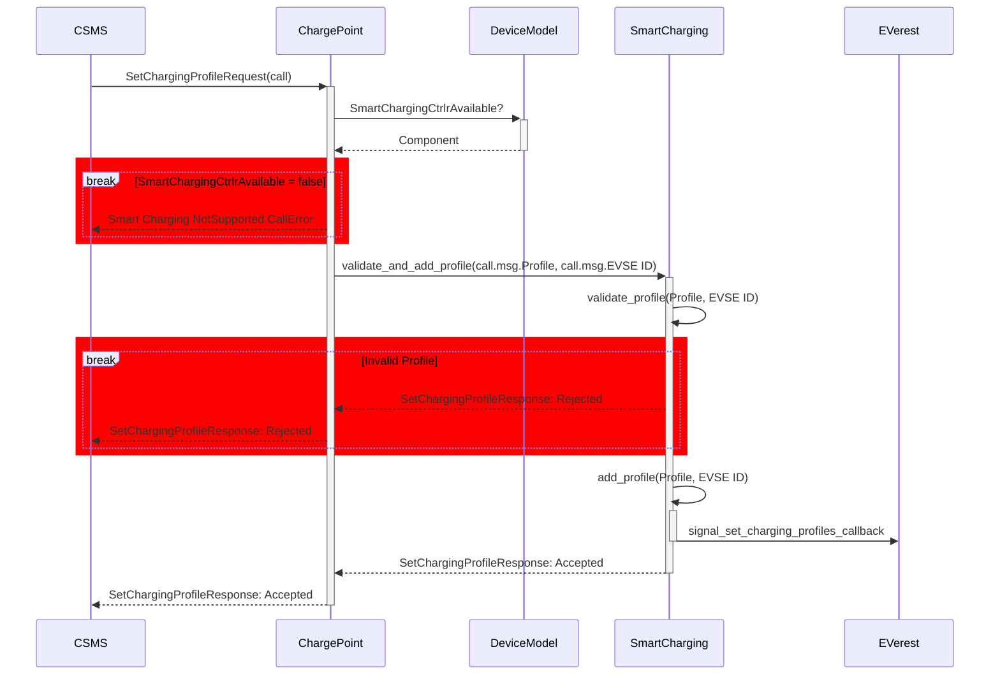
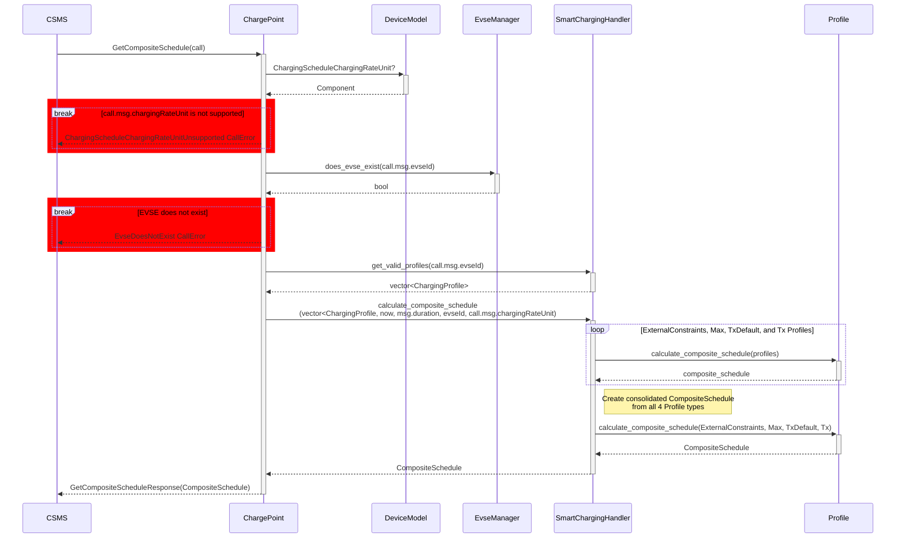
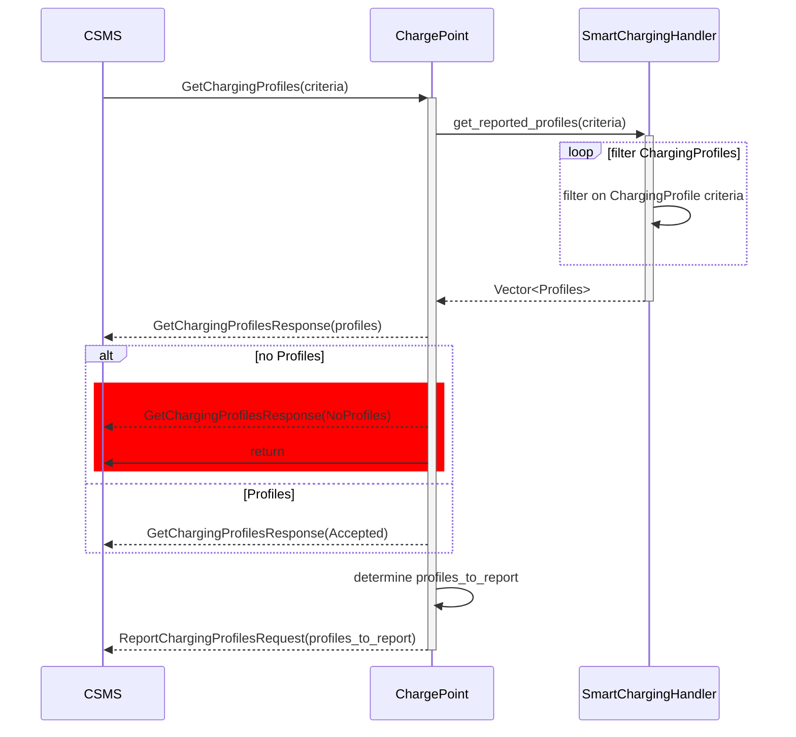
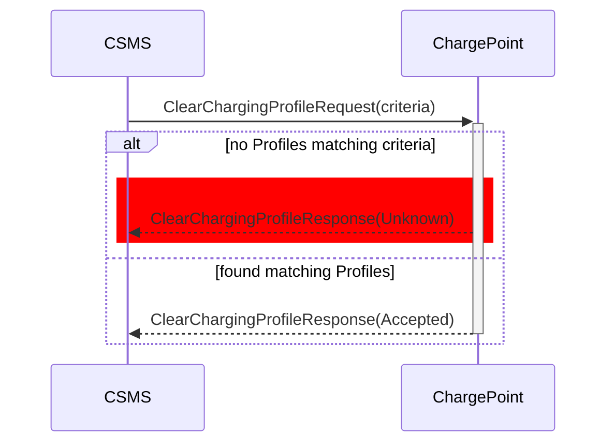

-----

# OCPP 2.0.1 in `libocpp`

The `ocpp::v201` namespace exposes a `ChargePoint` class capable of client-side OCPP 2.0.1 communications. It enables charging stations to communicate with a cloud backend over a websocket for the remote control of charging stations and administration of charging sessions.

> [!NOTE]
> For more information about the differences between versions of the Open Charge Point Protocol, please refer to the [Open Charge Alliance's website](https://openchargealliance.org/protocols/open-charge-point-protocol/).

The OCPP 2.0.1 implementation in `libocpp` is nearing completion, but there remain areas of active development. The OCA also does not currently plan to provide an official validation tool for all functionality within the protocol until the end of 2024. A high-level overview of supported functionality is provided [below](#supported-certification-profiles). For a more granular and up-to-date analysis of available OCPP 2.0.1 features in `libocpp`, please refer to the [OCPP 2.0.1 Status document](ocpp_201_status.md).


## Table of Contents

- [Supported Certification Profiles](#supported-certification-profiles)
- [CSMS Compatibility](#csms-compatibility)
- [Integration with EVerest](#integration-with-everest)
- [Standalone Integration](#standalone-integration)
  - [Callbacks to Register](#callbacks-to-register)
  - [Event Handlers](#event-handlers)
  - [Initialize the Database](#initialize-the-database)
- [OCPP 2.0.1 Use Cases in `libocpp`](#ocpp-201-use-cases-in-libocpp)
- [Quickstart for OCPP 2.0.1](#quickstart-for-ocpp-201)
- [Building with FetchContent Instead of EDM](#building-with-fetchcontent-instead-of-edm)
- [Unit Testing](#unit-testing)
- [Building the Doxygen Documentation](#building-the-doxygen-documentation)
- [Support for TPM Keys](#support-for-tpm-keys)
- [Support for `websocket++`](#support-for-websocket)
- [Support for `iface`](#support-for-iface)


## Supported Certification Profiles

Some optional OCPP 2.0.1 features are still being actively developed by the `libocpp` community. The following table shows which portions of the OCPP 2.0.1 implementation within `libocpp` are still being built out, broken down by [OCPP 2.0.1 Certification Profile](https://openchargealliance.org/certificationocpp/certification-ocpp-2-0-1/):

| OCPP 2.0.1 Functionality   | Supported                  |
| :------------------------- | :------------------------- |
| Core                       | :heavy_check_mark: Yes     |
| Advanced Security          | :construction: In Progress |
| Local Auth List Management | :hourglass: Planned        |
| Smart Charging             | :construction: In Progress |
| Advanced Device Management | :hourglass: Planned        |
| Advanced User Interface    | :hourglass: Planned        |
| Reservation                | :hourglass: Planned        |
| ISO 15118 Support          | :construction: In Progress |

| Whitepapers & Application Notes        | Supported                  |
| :------------------------------------- | :------------------------- |
| OCPP & California Pricing Requirements | :construction: In Progress |


## CSMS Compatibility

The ongoing development of OCPP 2.0.1 implementation is continuously tested against OCTT2 (OCPP Compliance Testing Tool 2), and has been tested against the following Charging Station Management Systems (CSMS):

| CSMS                                                                                 |
| :----------------------------------------------------------------------------------- |
| [ChargePoint](https://www.chargepoint.com/businesses/software)                                                                          |
| [CitrineOS](https://lfenergy.org/projects/citrineos/)                                |
| [Current](https://www.current.eco/)                                                                              |
| ihomer (Infuse CPMS)                                                                 |
| [Instituto Tecnológico de la Energía (ITE) HySGrid+](https://www.ite.es/i-d-i/proyectos/hysgrid/)                                            |
| [MaEVe (Thoughtworks)](https://github.com/thoughtworks/maeve-csms)                   |
| [Monta](https://monta.com)                                                           |
| [Open Charging Cloud (GraphDefined)](https://github.com/OpenChargingCloud/WWCP_OCPP) |
| [Switch EV](https://www.switch-ev.com/platform)                                                                            |
| [SWTCH Energy](https://swtchenergy.com/)                                                                                |

## Integration with EVerest

EVerest provides a simplified OCPP 2.0.1 integration path through its `OCPP201` module.

When setting up a development environment (or building) EVerest through the [`everest-core`](https://github.com/EVerest/everest-core) project, a version of `libocpp` will be pulled down as a dependency. If you wish to use the `OCPP201` module, you will want to defined your charging station's Device Model in the [`config.json` file](config/v201/config.json) for the `libocpp` repository pulled in by `everest-core` as a dependency. This configuration will be incorporated into `everest-core` during the latter's build process.

Once `everest-core` has been built with your station-specific `libocpp` configuration, you can then specify and configure `OCPP201` as a module in the [runtime configuration](https://everest.github.io/nightly/general/04_detail_module_concept.html#wiring-it-all-together-the-run-configuration) of your EVerest deployment.

## Standalone Integration

OCPP is a protocol that affects, controls, and monitors many areas of a charging station's operation. The `libocpp` library is just the messenger for this protocol. It is intended to provide mechanisms for connecting to and authenticating with a CSMS, sending and receiving the OCPP messages that govern behaviors in the standard, and to the track state required for a charging station to conform to the protocol all while minimizing hardware- or implementation-specific functionality.

The actual substance of how a charging station reacts to an OCPP command (such as `ResetRequest`) or when it should consider sending a command to the CSMS (such as `NotifyChargingLimitRequest`) is left to the rest of the charging station's systems. This is done by providing means of (a) registering **callbacks** that can be triggered by a `libocpp` `ChargePoint` in response to certain events and (b) reacting to various **event handlers** defined on a `ChargePoint` in other areas of the charging station's codebase.

> [!IMPORTANT]
> Integrating this library with your charging station requires both (a) defining **callbacks** that enable control of your station by `libocpp` and (b) calling `libocpp` **event handlers** in your charging station's systems in response to new events and data in order to keep `libocpp` up to date on station information.

### Terminology
Throughout this document and the `libocpp` codebase, the following conventions are followed:

- A **callback** is a function providing the actual station-specific implementation of an OCPP command. It allows a `libocpp` `ChargePoint` to control other systems within a charging station. By convention, each callback on a `ChargePoint` has a name suffixed with `_callback` (for instance, `unlock_connector_callback`). A `Callbacks` `struct` containing a complete set of desired callback implementations (as suitable `std::function` instances) should be provided to a 2.0.1 `ChargePoint` at construction time.

- An **event handler** is a public function defined on a `ChargePoint` that allows a charging station to update the state being tracked by the `ChargePoint` based on new information (meter values, charging session events, etc.) and (indirectly) send messages to a CSMS. By convention, the names of event handlers on the `ChargePoint` are each prefixed with `on_` (for instance, `on_meter_value`).

The complete set of callbacks and event handlers defined on an OCPP 2.0.1 `ChargePoint` can be viewed in the latter's [header file](/include/ocpp/v201/charge_point.hpp). Please use the [Doxygen documentation](#building-the-doxygen-documentation) as an additional source of information about the `ChargePoint` API.


### Callbacks to Register

| Callbacks                                               | Description |
| :------------------------------------------------------ | :---------- |
| `all_connectors_unavailable_callback`                   | Notifies that all connectors are unavailable. Used to handle charge availability requests and firmware updates. |
| `boot_notification_callback`                            | Callback to notify of a system boot |
| `clear_customer_information_callback`                   | Called to clear customer information based on passed in Customer Certificate, the IdToken for this request, and the Customer Identified that the request refers to. If IdToken is passed in will delete authorization cache entry from database. |
| `configure_network_connection_profile_callback`         | Called to configure a network connection profile when none is configured. |
| `connector_effective_operative_status_changed_callback` | Notifies the user of liboccp that the Operative/Inoperative state of a specific EVSE has changed. |
| `cs_effective_operative_status_changed_callback`        | Used to notify the user of libocpp that the Operative/Inoperative state of the charging station itself has changed. Will also call evse_effective_operative_status_changed_callback for each EVSE, and connector_effective_operative_status_changed_callback for each connector whose status has changed. |
| `data_transfer_callback`                                | Used to handle arbitrary data transfers. |
| `evse_effective_operative_status_changed_callback`      | Notifies the user of libocpp that the Operative/Inoperative state of an EVSE has changed. If as a result the state of connectors changed as well, libocpp will additionally call the connector_effective_operative_status_changed_callback for each connector. |
| `get_customer_information_callback`                     | Returns human readable customer information based on the CertificateHashDataType, IdToken and Customer Identifier passed in. |
| `get_log_request_callback`                              | Callback to return logs |
| `is_reservation_for_token_callback`                     | Check if the current reservation for the given evse id is made for the id token / group id token. |
| `is_reset_allowed_callback`                             | Callback if reset is allowed. If evse_id has a value, reset only applies to the given evse id. If it has no value, applies to complete charging station. |
| `ocpp_messages_callback`                                | Callback to congfigure ocpp message logging. |
| `pause_charging_callback`                               | Used to request pausing of charging, the "connector" parameter instructing which connector/EVSE to pause. |
| `remote_start_transaction_callback`                     | Called when the request can be accepted. The boolean authorize_remote_start indicates if Authorize.req needs to follow or not |
| `reset_callback`                                        | Performs a reset of the requested type |
| `security_event_callback`                               | Used to react to a security event callback. This callback is called only if the SecurityEvent occured internally within libocpp. Typically this callback is used to log security events in the security log. |
| `set_charging_profiles_callback`                        | Indicates when a charging profile is received and accepted. |
| `stop_transaction_callback`                             | Used to stop a transaction. Called when the idTagInfo.status of a StartTransaction.conf is not Accepted, when a RemoteStopTransaction.req is received, or when an UnlockConnector.req is received. |
| `time_sync_callback`                                    | Called on boot notification if the TimeSource ControllerComponent contains Heartbeat. |
| `transaction_event_callback`                            | Called when a transaction_event was sent to the CSMS. |
| `transaction_event_response_callback`                   | Called when a transaction_event_response was received from the CSMS. |
| `unlock_connector_callback`                             | Used by libocpp to force unlock a connector |
| `update_firmware_request_callback`                      | Initiates a firmware update request. Triggers a security event notification if the certificate is Invalid or Revoked. |
| `validate_network_profile_callback`                     | Validates the submitted Network Profile. Is Rejected if:<br>• No callback registered to validate network profile<br>• CSMS attempted to set a network profile with a lower securityProfile<br>• CSMS attempted to set a network profile that could not be validated<br>• Network profile could not be written to the device model storage<br> |
| `variable_changed_callback`                             | Called when a variable has been changed by the CSMS |

### Event Handlers

<!-- FIXME: Add a table of the current event handlers, or get rid of this section. -->
The complete set of event handlers defined on an OCPP 2.0.1 `ChargePoint` can be viewed in the latter's [header file](/include/ocpp/v201/charge_point.hpp). Please use the [Doxygen documentation](#building-the-doxygen-documentation) as an additional source of information about the `ChargePoint` API.

### Initialize the Database

To initialize the database where a `ChargePoint` will persist state, please use the provided [SQLite database](/doc/database_migrations.md) or implement your own storage drive.

## OCPP 2.0.1 Use Cases in `libocpp`

The OCPP 2.0.1 specification is broken down into concrete functional requirements using a three-tier system. At the top, there are sixteen **functional blocks** lettered A through P that describe the high-level desired capabilities of actors adhering to the standard. These functional blocks are then broken into **use cases** that describe different scenarios in which one or more charging stations, local controllers, and charging station management systems might find themselves. The required and optional behaviors of these systems in these scenarios are then declared as **functional requirements** within each use case.

This section includes an overview of how a subset of the OCPP 2.0.1 use cases that supported by `libocpp` are implemented in conjunction with callbacks provided by the charging station. We hope it serves as a useful guide to portions of the `libocpp` API and illustrates patterns of interaction between `libocpp` and other systems within a charging station.

> [!NOTE]
> Our goal is not to reproduce the entire OCPP 2.0.1 specification in this document. Rather we intend to illustrate how various use cases are realized using `ChargePoint` methods in `libocpp` in conjunction with callback implementations and event handlers.
>
> Please refer to the [OCPP 2.0.1 standard](https://openchargealliance.org/protocols/open-charge-point-protocol/#OCPP2.0.1) for more details. Functional blocks, use cases, and functional requirements are addressed in Part 2 of Edition 2.

| Functional Block | Subject                                     |
| :--------------- | :------------------------------------------ |
| A                | Security                                    |
| B                | Provisioning                                |
| C                | Authorization                               |
| D                | Local Authorization List Management         |
| E                | Transactions                                |
| F                | Remote Control                              |
| G                | Availability                                |
| H                | Reservation                                 |
| I                | Tariff and Cost                             |
| J                | Meter Values                                |
| K                | [Smart Charging](#smart-charging-use-cases) |
| L                | Firmware Management                         |
| M                | ISO 15118 Certificate Management            |
| N                | Diagnostics                                 |
| O                | Display Message                             |
| P                | Data Transfer                               |

### Smart Charging Use Cases

The use cases within the Smart Charging functional block are subdivided into the following three categories of use cases:

1. General Smart Charging (Use Cases K01–K10)
2. External Charging Limit-based Smart Charging (K11–K14)
3. ISO 15118-based Smart Charging (K15–K17)

Support for General and External Charging Limit-based Smart Charging is largely complete, with ISO 15118-based Smart Charging under active development. For an up-to-date overview of exactly which features are currently supported as well as design decisions that have been made to address optional or ambiguous functional requirements, please refer to the [OCPP 2.0.1 Status document](ocpp_201_status.md).

#### K01 SetChargingProfile

Allows the CSMS to influence the charging power or current drawn from a specific EVSE or the
entire Charging Station over a period of time.



Profile validation returns the following errors to the caller when a Profile
is `Rejected`:

| Errors                                                        | Description                                                                                                                                                                                                                                         |
| :------------------------------------------------------------ | :-------------------------------------------------------------- |
| `ChargingProfileFirstStartScheduleIsNotZero`                  | The `startPeriod` of the first `chargingSchedulePeriod` needs to be 0.<br>[K01.FR.31] |
| `ChargingProfileNoChargingSchedulePeriods`                    | Happens when the `ChargingProfile` doesn't have any Charging Schedule Periods. |
| `ChargingScheduleChargingRateUnitUnsupported`                 | Happens when a chargingRateUnit is passed in that is not configured in the `ChargingScheduleChargingRateUnit`. [K01.FR.26] |
| `ChargingSchedulePeriodInvalidPhaseToUse`                     | Happens when an invalid `phaseToUse` is passed in. [K01.FR.19] [K01.FR.48] |
| `ChargingSchedulePeriodPhaseToUseACPhaseSwitchingUnsupported` | Happens when phaseToUse is passed in and the EVSE does not have `ACPhaseSwitchingSupported` defined and set to true. [K01.FR.20] [K01.FR.48] |
| `ChargingSchedulePeriodsOutOfOrder`                           | `ChargingSchedulePeriod.startPeriod` elements need to be in increasing values. [K01.FR.35] |
| `ChargingStationMaxProfileCannotBeRelative`                   | Happens when a `ChargingStationMaxProfile.chargingProfileKind` is set to `Relative`. [K01.FR.38] |
| `ChargingStationMaxProfileEvseIdGreaterThanZero`              | Happens when a `ChargingStationMaxProfile` is attempted to be set with an EvseID isn't `0`. [K01.FR.03] |
| `ChargingProfileMissingRequiredStartSchedule`                 | Happens when an `Absolute` or `Recurring` `ChargingProfile` doesn't have a `startSchedule`. [K01.FR.40] |
| `ChargingProfileExtraneousStartSchedule`                      | Happens when a Relative `ChargingProfile` has a `startSchedule`. [K01.FR.41] |
| `EvseDoesNotExist`                                            | Happens when the `evseId`of a `SetChargingProfileRequest` does not exist. [K01.FR.28] |
| `ExistingChargingStationExternalConstraints`                  | Happens when a `SetChargingProfileRequest` Profile has a purpose of `ChargingStationExternalConstraints` and one already exists with the same `ChargingProfile.id` exists. [K01.FR.05] |
| `InvalidProfileType`                                          | Happens when a `ChargingStationMaxProfile` is attempted to be set with a `ChargingProfile` that isn't a `ChargingStationMaxProfile`. |
| `TxProfileEvseHasNoActiveTransaction`                         | Happens when a `SetChargingProfileRequest` with a `TxProfile` is submitted and there is no transaction active on the specified EVSE. [K01.FR.09] |
| `TxProfileEvseIdNotGreaterThanZero`                           | `TxProfile` needs to have an `evseId` greater than 0. [K01.FR.16] |
| `TxProfileMissingTransactionId`                               | A `transactionId` is required for`SetChargingProfileRequest`s with a `TxProfile` in order to match the profile to a specific transation. [K01.FR.03] |
| `TxProfileTransactionNotOnEvse`                               | Happens when the provided `transactionId` is not known. [K01.FR.33] |
| `TxProfileConflictingStackLevel`                              | Happens when a TxProfile has a stackLevel and transactionId combination already exists in a TxProfile with a different id in order to ensure that no two charging profiles with same stack level and purpose can be valid at the same time. [K01.FR.39] |


#### K08 Get Composite Schedule

The CSMS requests the Charging Station to report the Composite Charging
Schedule, as calculated by the Charging Station for a specific point of
time, and may change over time due to external causes such as local
balancing based on grid connection capacity and EVSE availablity.

The Composite Schedule is the result of result of merging the time periods
set in the `ChargingStationMaxProfile`, `ChargingStationExternalConstraints`,
`TxDefaultProfile` and `TxProfile` type profiles.




#### K09 Get Charging Profiles

Returns to the CSMS the Charging Schedules/limits installed on a Charging Station based on the 
passed in criteria.




#### K10 Clear Charging Profile

Clears Charging Profiles installed on a Charging Station based on the
passed in criteria.




## Quickstart for OCPP 2.0.1

This section walks you through how to sanity check that your `libocpp` development environment is set up effectively. The process will involve the following:

1. Download `libocpp` from GitHub
2. Ensuring you've installed `libocpp`'s system dependencies
3. Standing up and configuring a CSMS (that is, an OCPP server) locally
4. Updating the default OCPP device model file
5. Building `libocpp` as an OCPP 2.0.1 client executable
6. Running this freshly built binary

This approach can also be used later in development for testing an actual station's device model and configuration is valid in the eyes of a CSMS.


### Download `libocpp`
You'll first want to download the source code for `libocpp` from this repository:

```bash
git clone https://github.com/EVerest/libocpp.git
```


### Installing System Dependencies
To be able to build `libocpp`, your system needs a compatible compiler, build tools, and development libraries and headers for several dependencies installed. For instance, on Debian GNU/Linux 11, these can be installed as follows:

```bash
    sudo apt install build-essential \
                     cmake \
                     ninja-build \
                     libboost-all-dev \
                     libsqlite3-dev \
                     libssl-dev \
                     python3-pip
```

> [!WARNING]
> OpenSSL version 3.0 or above is required.


### Standing up a CSMS
The configuration of a `libocpp` deployment includes information about the websocket URL(s) one or more `ChargePoint`s will use to communicate with a CSMS that supports OCPP 2.0.1. Before continuing, ensure that you have access to such an application for testing purposes. If not, there are free options that play nicely with EVerest and support simple local deployments _via_ containers. These include [CitrineOS](https://citrineos.github.io/) and [MaEVe](https://github.com/thoughtworks/maeve-csms/).

Once you have access to a CSMS, you can (1) register a new charge point ID for testing and (2) provide this charge point ID and the CSMS websocket URL as the `ChargePointId` and within the `NetworkConnectionProfiles` variable in the `InternalCtrlr`, respectively. Instructions for accomplishing step (1) should be provided in your CSMS's documentation. More information about step (2) is provided in the [next section](#configuring-your-charging-station).


### Configuring Your Charging Station
Before building the client binary, you will want to update the [`libocpp` configuration file](/config/v201/config.json) with accurate information about your desired charging station's hardware and how to access your CSMS. This configuration file includes an OCPP 2.0.1 device model for a charging station with two EVSEs, support for multiple network profiles, certificate-based authentication, etc. It also offers a host of `libocpp`-specific settings in an `InternalCtrlr` settings block.

> [!INFO]
> We are editing this configuration prior to compiling `libocpp` here for convenience, but it is not a requirement. Doing so simply copies your customized configuration into the appropriate location in the `libocpp` installation directory. Specifically, you can provide any config file to `charge_point` by passing it to the `--config` parameter at runtime, providing its path relative to
> ```
>     <installation directory>/share/everest/modules/OCPP
> ```
> (For instance, `<installation directory>` in this tutorial is `build/dist` within your `libocpp` repository.)

Tailoring a device model to your station hardware and software is a large subject that deserves its own documentation. For now, we recommend at least validating the following about variables in the `InternalCtrlr`:

1. the `ChargePointId` variable matches the ID you've set (or plan to set) for this charging station in the CSMS, and
2. within the value of the `NetworkConnectionProfiles` variable, the `ocppCsmsUrl` field for the network connection profile you plan to use matches the websocket URL for your CSMS.

For completeness, we've also provided a table below of each `InternalCtrlr` variable as well as available metadata about the variable coming from the [`InternalCtrlr`'s JSON Schema file](/config/v201/component_config/standardized/InternalCtrlr.json).

<details><summary><code>InternalCtrlr</code> Variables</summary>
  <p>
    <markdown-accessiblity-table data-catalyst="">
      <table role="table">
        <thead>
          <tr>
            <th>Variable</th>
            <th>Type</th>
            <th>Default</th>
            <th>Description</th>
          </tr>
        </thead>
        <tbody>
          <tr>
            <th>InternalCtrlrEnabled</th>
            <td>boolean</td>
            <td>true</td>
            <td>None Provided</td>
          </tr>
          <tr>
            <th>ChargePointId</th>
            <td>string</td>
            <td></td>
            <td>None Provided</td>
          </tr>
          <tr>
            <th>NetworkConnectionProfiles</th>
            <td>string</td>
            <td>
              <code>"[{\"configurationSlot\": 1, \"connectionData\": {\"messageTimeout\": 30, \"ocppCsmsUrl\": \"ws://localhost:9000\", \"ocppInterface\": \"Wired0\", \"ocppTransport\": \"JSON\", \"ocppVersion\": \"OCPP20\", \"securityProfile\": 1}}]"</code>
            </td>
            <td>
              List of NetworkConnectionProfiles that define the functional and
              technical parameters of a communication link. Must be a (JSON) string
              with the format of <code>SetNetworkProfileRequest</code>.
            </td>
          </tr>
          <tr>
            <th>ChargeBoxSerialNumber</th>
            <td>string</td>
            <td></td>
            <td>None Provided</td>
          </tr>
          <tr>
            <th>ChargePointModel</th>
            <td>string</td>
            <td></td>
            <td>None Provided</td>
          </tr>
          <tr>
            <th>ChargePointSerialNumber</th>
            <td>string</td>
            <td></td>
            <td>None Provided</td>
          </tr>
          <tr>
            <th>ChargePointVendor</th>
            <td>string</td>
            <td></td>
            <td>None Provided</td>
          </tr>
          <tr>
            <th>FirmwareVersion</th>
            <td>string</td>
            <td></td>
            <td>None Provided</td>
          </tr>
          <tr>
            <th>ICCID</th>
            <td>string</td>
            <td></td>
            <td>None Provided</td>
          </tr>
          <tr>
            <th>IMSI</th>
            <td>string</td>
            <td></td>
            <td>None Provided</td>
          </tr>
          <tr>
            <th>MeterSerialNumber</th>
            <td>string</td>
            <td></td>
            <td>None Provided</td>
          </tr>
          <tr>
            <th>MeterType</th>
            <td>string</td>
            <td></td>
            <td>None Provided</td>
          </tr>
          <tr>
            <th>SupportedCiphers12</th>
            <td>string</td>
            <td>
              <code>"ECDHE-ECDSA-AES128-GCM-SHA256:ECDHE-ECDSA-AES256-GCM-SHA384:AES128-GCM-SHA256:AES256-GCM-SHA384"</code>
            </td>
            <td>None Provided</td>
          </tr>
          <tr>
            <th>SupportedCiphers13</th>
            <td>string</td>
            <td>
              <code>"TLS_AES_256_GCM_SHA384:TLS_AES_128_GCM_SHA256"</code>
            </td>
            <td>None Provided</td>
          </tr>
          <tr>
            <th>AuthorizeConnectorZeroOnConnectorOne</th>
            <td>boolean</td>
            <td>true</td>
            <td>None Provided</td>
          </tr>
          <tr>
            <th>LogMessages</th>
            <td>boolean</td>
            <td>true</td>
            <td>None Provided</td>
          </tr>
          <tr>
            <th>LogMessagesFormat</th>
            <td>string</td>
            <td><code>"log,html,security"</code></td>
            <td>
              Supported log formats are <code>console</code>, <code>log</code>,
              <code>html</code>, <code>console_detailed</code>,
              <code>callback</code> and <code>security</code>.
              <code>"security"</code> logs security events into a seperate logfile
            </td>
          </tr>
          <tr>
            <th>LogRotation</th>
            <td>boolean</td>
            <td>false</td>
            <td>Enable log rotation</td>
          </tr>
          <tr>
            <th>LogRotationDateSuffix</th>
            <td>boolean</td>
            <td>false</td>
            <td>
              Use a datetime suffix in log rotation files instead of the traditional
              <code>.0</code>, <code>.1</code>
            </td>
          </tr>
          <tr>
            <th>LogRotationMaximumFileSize</th>
            <td>integer</td>
            <td>0</td>
            <td>
              Maximum file size in bytes for the log file after which it will be
              rotated. Setting this to 0 disables log rotation.
            </td>
          </tr>
          <tr>
            <th>LogRotationMaximumFileCount</th>
            <td>integer</td>
            <td>0</td>
            <td>
              Maximum amount of files before rotated logs will be deleted. Setting
              this to 0 disables log rotation.
            </td>
          </tr>
          <tr>
            <th>SupportedChargingProfilePurposeTypes</th>
            <td>string</td>
            <td><code>"ChargePointMaxProfile,TxDefaultProfile,TxProfile"</code></td>
            <td>None Provided</td>
          </tr>
          <tr>
            <th>MaxCompositeScheduleDuration</th>
            <td>integer</td>
            <td>31536000</td>
            <td>None Provided</td>
          </tr>
          <tr>
            <th>NumberOfConnectors</th>
            <td>integer</td>
            <td>1</td>
            <td>None Provided</td>
          </tr>
          <tr>
            <th>UseSslDefaultVerifyPaths</th>
            <td>boolean</td>
            <td>true</td>
            <td>Use default verify paths for validating CSMS server certificate</td>
          </tr>
          <tr>
            <th>VerifyCsmsCommonName</th>
            <td>boolean</td>
            <td>true</td>
            <td>None Provided</td>
          </tr>
          <tr>
            <th>UseTPM</th>
            <td>boolean</td>
            <td>false</td>
            <td>None Provided</td>
          </tr>
          <tr>
            <th>VerifyCsmsAllowWildcards</th>
            <td>boolean</td>
            <td>false</td>
            <td>None Provided</td>
          </tr>
          <tr>
            <th>IFace</th>
            <td>string</td>
            <td><code>""</code></td>
            <td>None Provided</td>
          </tr>
          <tr>
            <th>EnableTLSKeylog</th>
            <td>boolean</td>
            <td>false</td>
            <td>None Provided</td>
          </tr>
          <tr>
            <th>TLSKeylogFile</th>
            <td>string</td>
            <td>/tmp/ocpp_tlskey.log</td>
            <td>None Provided</td>
          </tr>
          <tr>
            <th>OcspRequestInterval</th>
            <td>integer</td>
            <td>604800</td>
            <td>
              Interval in seconds used to request OCSP revocation status information
              on the CSO Sub-CA certificates
            </td>
          </tr>
          <tr>
            <th>WebsocketPingPayload</th>
            <td>string</td>
            <td>hello there</td>
            <td>None Provided</td>
          </tr>
          <tr>
            <th>WebsocketPongTimeout</th>
            <td>integer</td>
            <td>5</td>
            <td>None Provided</td>
          </tr>
          <tr>
            <th>MonitorsProcessingInterval</th>
            <td>integer</td>
            <td>1</td>
            <td>
              Defines the interval at which the periodic monitors will be processed,
              in seconds
            </td>
          </tr>
          <tr>
            <th>MaxCustomerInformationDataLength</th>
            <td>integer</td>
            <td>51200</td>
            <td>Maximum number of characters of Customer Information data</td>
          </tr>
          <tr>
            <th>V2GCertificateExpireCheckInitialDelaySeconds</th>
            <td>integer</td>
            <td>60</td>
            <td>
              Seconds to wait after boot notification to first check the V2G leaf
              certificate for expiration and potential renewal
            </td>
          </tr>
          <tr>
            <th>V2GCertificateExpireCheckIntervalSeconds</th>
            <td>integer</td>
            <td>43200</td>
            <td>
              Seconds between two checks for V2G leaf certificate expiration and
              potential renewal
            </td>
          </tr>
          <tr>
            <th>ClientCertificateExpireCheckInitialDelaySeconds</th>
            <td>integer</td>
            <td>60</td>
            <td>
              Seconds to wait after boot notification to first check the client
              certificate for expiration and potential renewal
            </td>
          </tr>
          <tr>
            <th>ClientCertificateExpireCheckIntervalSeconds</th>
            <td>integer</td>
            <td>43200</td>
            <td>
              Seconds between two checks for client certificate expiration and
              potential renewal
            </td>
          </tr>
          <tr>
            <th>UpdateCertificateSymlinks</th>
            <td>boolean</td>
            <td>false</td>
            <td>None Provided</td>
          </tr>
          <tr>
            <th>MessageQueueSizeThreshold</th>
            <td>integer</td>
            <td></td>
            <td>
              Threshold for the size of in-memory message queues used to buffer
              messages (and store e.g. while offline). If threshold is exceeded,
              messages  will be dropped according to OCPP specification to avoid
              memory issues.
            </td>
          </tr>
          <tr>
            <th>MaxMessageSize</th>
            <td>integer</td>
            <td>32000</td>
            <td>
              Maximum size in bytes for messages sent to the CSMS via websocket. If
              a message exceeds this size and is eligible to be split into multiple
              messages, it will be split. Otherwise, this value is ignored.
            </td>
          </tr>
          <tr>
            <th>SupportedCriteria</th>
            <td>string</td>
            <td><code>"Enabled,Active,Problem,Available"</code></td>
            <td>
              List of criteria supported for a get custom report.
              <code>Enabled,Active,Problem,Available</code>
            </td>
          </tr>
          <tr>
            <th>RoundClockAlignedTimestamps</th>
            <td>boolean</td>
            <td>false</td>
            <td>
              If enabled the <code>metervalues</code> configured with the
              <code>AlignedDataCtrlr</code> will be rounded to the exact time
              intervals
            </td>
          </tr>
          <tr>
            <th>ResumeTransactionsOnBoot</th>
            <td>boolean</td>
            <td>false</td>
            <td>
              If enabled the transactions that were active before shutdown will be
              resumed, if possible
            </td>
          </tr>
        </tbody>
      </table>
    </markdown-accessiblity-table>
  </p>
</details>


### Building `libocpp` as an OCPP 2.0.1 Client Executable
From the root directory of the `libocpp` repository, you can then configure, build, and install this library (including the charge point client) using CMake and Ninja:

```bash
    cmake -B build -G Ninja -DBUILD_TESTING=ON \
                            -DCMAKE_INSTALL_PREFIX="./build/dist" \
                            -DCMAKE_EXPORT_COMPILE_COMMANDS=ON
    cmake -B -DCMAKE_INSTALL_PREFIX=./dist ..
    make -j$(nproc) install
```


### Running the `libocpp` Charge Point Binary
Congratulations! You've successfully built `libocpp`! The `build/dist` directory should now contain an installation of `libocpp` including a simple OCPP client binary at `build/dist/bin/charge_point`. It can be run by providing a working directory and `libocpp` configuration file as follows:

```bash
  ./dist/bin/charge_point --maindir ./dist --conf config.json
```

Type `help` to see a list of possible commands.


## Unit Testing

GTest is required for building the test cases target.
To build the target and run the tests you can reference the script `.ci/build-kit/install_and_test.sh`.
The script allows the GitHub Actions runner to execute.

Local testing:

```bash
mkdir build
cmake -B build -DBUILD_TESTING=ON -DCMAKE_BUILD_TYPE=Debug -DCMAKE_INSTALL_PREFIX="./dist"
cd build
make -j$(nproc) install
```


## Building with FetchContent Instead of EDM

In [doc/build-with-fetchcontent](/doc/build-with-fetchcontent) you can find an example how to build libocpp with FetchContent instead of EDM.


Run any required tests from build/tests.


## Building the Doxygen Documentation

```bash
  cmake -S . -B build
  cmake --build build --target doxygen-ocpp
```

You will find the generated Doxygen documentation at:
`build/dist/docs/html/index.html`

The main reference for the integration of libocpp for OCPP2.0.1 is the ocpp::v201::ChargePoint class defined in libocpp/include/ocpp/v201/charge_point.hpp.


## Support for TPM Keys

In order to use the TPM keys, it is mandatory to use the default `libwebsocket` implementation.


## Support for `websocket++`

The old `websocket++` implementation has been deprecated. For enabling `websocket++` support use the following cmake option:

```bash
  cmake .. -DLIBOCPP_ENABLE_DEPRECATED_WEBSOCKETPP=ON
```


## Support for `iface`

In order to connect through a custom network `iface`, a custom internal config variable 'IFace' can be used.

```json
"Internal": {        
    "IFace" : "enp43s0"
}
```

