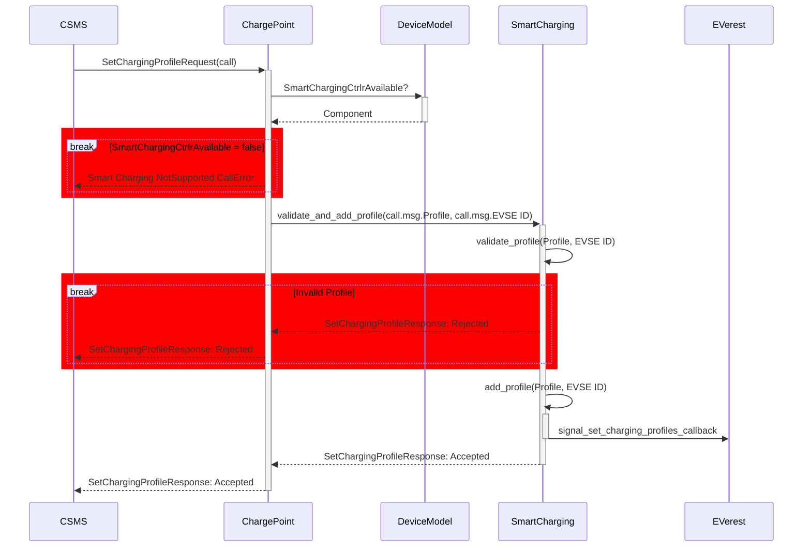
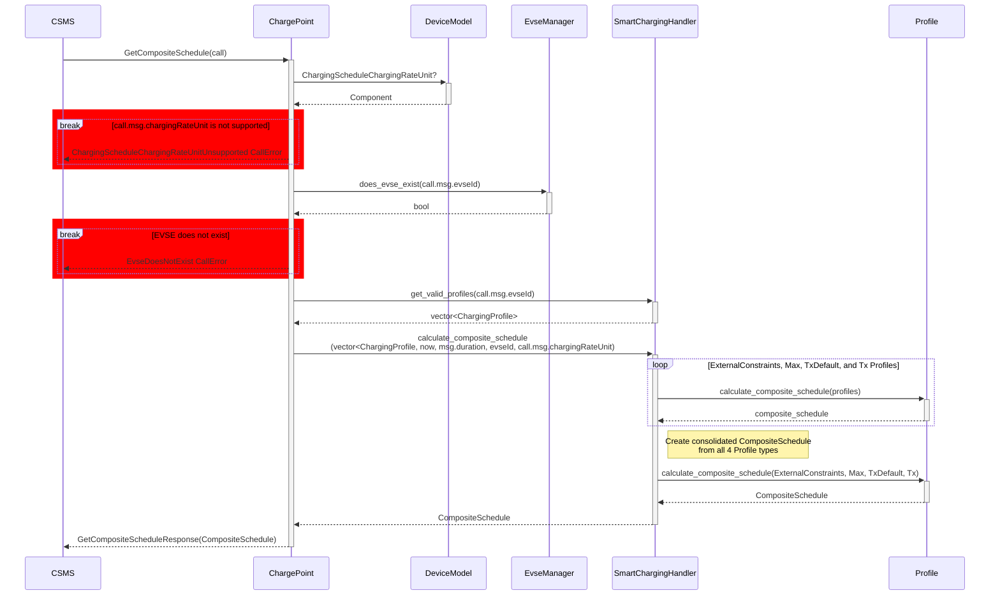
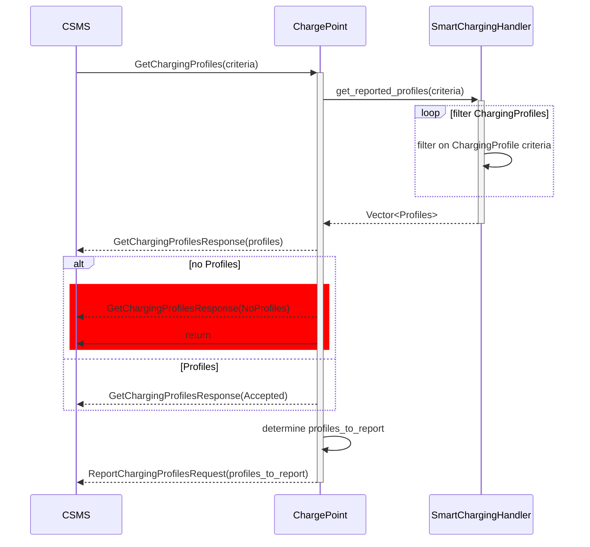
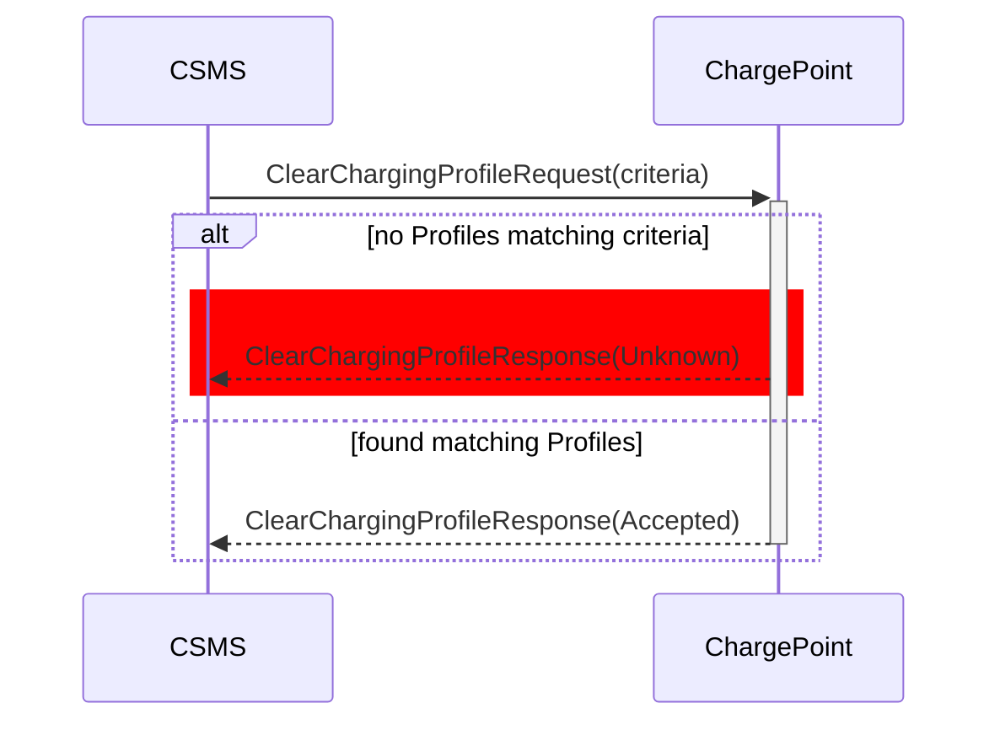

-----

# EVerest OCPP 2.0.1 Implementation (libocpp)
This is a C++ library implementation of OCPP for version 2.0.1
(see [OCPP protocols at OCA website](https://openchargealliance.org/protocols/open-charge-point-protocol/)).

It enables charging stations to communicate with cloud backends for remote control, monitoring and billing of charging processes.

Libocpp can be used for the communication of one charging station and multiple EVSE using a single websocket connection.

OCPP 2.0.1 is currently under development.


## Table of contents

- [Functionality Support](#functionality-support)
- [CSMS Compatibility](#csms-compatibility)
- [Integration with EVerest](#integration-with-everest)
- [Standalone Integration](#standalone-integration)
  - [Key Integration Points](#key-integration-points)
  - [Callbacks to Register](#callbacks-to-register)
  - [Event Handlers to Call](#event-handlers-to-call)
  - [Initialize the Database](#initialize-the-database)
  - [OCPP 2.0.1 Use Cases](#ocpp-201-use-cases)
- [Quickstart for OCPP 2.0.1](#quickstart-for-ocpp-201)
- [Build and Install `libocpp`](#build-and-install-libocpp)
- [Building with FetchContent Instead of EDM](#building-with-fetchcontent-instead-of-edm)
- [Unit Testing](#unit-testing)
- [Building the Doxygen Documentation](#building-the-doxygen-documentation)
- [Support for TPM Keys](#support-for-tpm-keys)
- [Support for `websocket++`](#support-for-websocket)
- [Support for `iface`](#support-for-iface)


## Functionality Support

The development of OCPP 2.0.1 implementation is in progress — [OCPP 2.0.1 status](/doc/ocpp_201_status.md). The following table shows the current support for OCPP 2.0.1 functionalities in libocpp:

| OCPP 2.0.1 Functionality   | Supported                  |
| :------------------------- | :------------------------- |
| Core                       | :heavy_check_mark: Yes     |
| Advanced Security          | :construction: In Progress |
| Local Auth List Management | :hourglass: Planned        |
| Smart Charging             | :construction: In Progress |
| Advanced Device Management | :hourglass: Planned        |
| Advanced User Interface    | :hourglass: Planned        |
| Reservation                | :hourglass: Planned        |
| ISO 15118 support          | :construction: In Progress |

| Whitepapers & Application Notes        | Supported                  |
| :------------------------------------- | :------------------------- |
| OCPP & California Pricing Requirements | :construction: In Progress |


## CSMS Compatibility

The ongoing development of OCPP 2.0.1 implementation is continuously tested against OCTT2 (OCPP Compliance Testing Tool 2), and has been tested against the following Charging Station Management Systems (CSMS):

| CSMS                                                                                 |
| :----------------------------------------------------------------------------------- |
| Chargepoint                                                                          |
| [CitrineOS](https://lfenergy.org/projects/citrineos/)                                |
| Current                                                                              |
| ihomer (Infuse CPMS)                                                                 |
| Instituto Tecnológico de la Energía (ITE)                                            |
| [MaEVe (Thoughtworks)](https://github.com/thoughtworks/maeve-csms)                   |
| [Monta](https://monta.com)                                                           |
| [Open Charging Cloud (GraphDefined)](https://github.com/OpenChargingCloud/WWCP_OCPP) |
| Switch EV                                                                            |
| SWTCH                                                                                |

## Integration with EVerest

The libocpp OCPP 2.0.1 module is automatically integrated within [everest-core](https://github.com/EVerest/everest-core) — the complete software stack for your charging station. 

When you run libocpp with OCPP 2.0.1 through EVerest, the build process of everest-core handles the installation of all necessary dependencies. This includes initializing the device model database using the [config.json](config/v201/config.json) file.

## Standalone Integration

If you wish to integrate libocpp's OCPP 2.0.1 implementation directly into your charging station software without using the full EVerest stack, you'll need to register several **callbacks** and implement **event handlers**. This allows libocpp to interact with your charging station according to OCPP requirements.

### Key Integration Points

1. [**Callbacks**](#callbacks-to-register): Register these to allow libocpp to execute commands defined in OCPP (e.g., Reset.req or RemoteStartTransaction.req).
2. [**Event Handlers**](#event-handlers-to-call): Call these to notify libocpp of events, enabling the library to track the charging station's state and trigger appropriate OCPP messages (e.g., MeterValues.req, StatusNotification.req).

> [!note]
> The public API for these integrations are found in the [ChargePoint](/include/ocpp/v201/charge_point.hpp).


### Callbacks to Register

| callbacks                                               | description |
| :------------------------------------------------------ | :---------- |
| `all_connectors_unavailable_callback`                   | Notifies that all connectors are unavailable. Used to handle charge availability requests and firmware updates. |
| `boot_notification_callback`                            | Callback to notify of a system boot |
| `clear_customer_information_callback`                   | Called to clear customer information based on passed in Customer Certificate, the IdToken for this request, and the Customer Identified that the request refers to. If IdToken is passed in will delete authorization cache entry from database. |
| `configure_network_connection_profile_callback`         | Called to configure a network connection profile when none is configured. |
| `connector_effective_operative_status_changed_callback` | Notifies the user of liboccp that the Operative/Inoperative state of a specific EVSE has changed. |
| `cs_effective_operative_status_changed_callback`        | Used to notify the user of libocpp that the Operative/Inoperative state of the charging station itself has changed. Will also call evse_effective_operative_status_changed_callback for each EVSE, and connector_effective_operative_status_changed_callback for each connector whose status has changed. |
| `data_transfer_callback`                                | Used to handle arbitrary data transfers. |
| `evse_effective_operative_status_changed_callback`      | Notifies the user of libocpp that the Operative/Inoperative state of an EVSE has changed. If as a result the state of connectors changed as well, libocpp will additionally call the connector_effective_operative_status_changed_callback for each connector. |
| `get_customer_information_callback`                     | Returns human readable customer information based on the CertificateHashDataType, IdToken and Customer Identifier passed in. |
| `get_log_request_callback`                              | Callback to return logs |
| `is_reservation_for_token_callback`                     | Check if the current reservation for the given evse id is made for the id token / group id token. |
| `is_reset_allowed_callback`                             | Callback if reset is allowed. If evse_id has a value, reset only applies to the given evse id. If it has no value, applies to complete charging station. |
| `ocpp_messages_callback`                                | Callback to congfigure ocpp message logging. |
| `pause_charging_callback`                               | Used to request pausing of charging, the "connector" parameter instructing which connector/EVSE to pause. |
| `remote_start_transaction_callback`                     | Called when the request can be accepted. The boolean authorize_remote_start indicates if Authorize.req needs to follow or not |
| `reset_callback`                                        | Performs a reset of the requested type |
| `security_event_callback`                               | Used to react to a security event callback. This callback is called only if the SecurityEvent occured internally within libocpp. Typically this callback is used to log security events in the security log. |
| `set_charging_profiles_callback`                        | Indicates when a charging profile is received and accepted. |
| `stop_transaction_callback`                             | Used to stop a transaction. Called when the idTagInfo.status of a StartTransaction.conf is not Accepted, when a RemoteStopTransaction.req is received, or when an UnlockConnector.req is received. |
| `time_sync_callback`                                    | Called on boot notification if the TimeSource ControllerComponent contains Heartbeat. |
| `transaction_event_callback`                            | Called when a transaction_event was sent to the CSMS. |
| `transaction_event_response_callback`                   | Called when a transaction_event_response was received from the CSMS. |
| `unlock_connector_callback`                             | Used by libocpp to force unlock a connector |
| `update_firmware_request_callback`                      | Initiates a firmware update request. Triggers a security event notification if the certificate is Invalid or Revoked. |
| `validate_network_profile_callback`                     | Validates the submitted Network Profile. Is Rejected if:<br>• No callback registered to validate network profile<br>• CSMS attempted to set a network profile with a lower securityProfile<br>• CSMS attempted to set a network profile that could not be validated<br>• Network profile could not be written to the device model storage<br> |
| `variable_changed_callback`                             | Called when a variable has been changed by the CSMS |

### Event Handlers to Call
Event handlers to call are found in the [ChargePoint](https://github.com/EVerest/libocpp/blob/2124d055f9cc8f253d3a2441ec2d70686174d0ed/include/ocpp/v201/charge_point.hpp#L116).

### Initialize the Database

Use provided [SQLite database](/doc/database_migrations.md) or implement your own storage drive.

### OCPP 2.0.1 Use Cases

| Clause | Use Case Name                     |
| :----- | :-------------------------------- |
| A      | Security                          |
| B      | Provisioning                      |
| C      | Authorization                     |
| D      | LocalAuthorizationList Management |
| E      | Transactions                      |
| F      | RemoteControl                     |
| G      | Availability                      |
| H      | Reservation                       |
| I      | TariffAndCost                     |
| J      | MeterValues                       |
| K      | SmartCharging                     |
| L      | FirmwareManagement                |
| M      | ISO 15118 CertificateManagement   |
| N      | Diagnostics                       |
| O      | DisplayMessage                    |
| P      | DataTransfer                      |

### Smart Charging

Smart Charging is a use case within OCPP.
Work to fully support OCPP 2.0.1 Smart Charging is ongoing. Most functional requirements for General Smart Charging use cases (that is, K01–K10) are now supported. For an up-to-date overview of which features are currently supported, please refer to the [OCPP 2.0.1 Status](/doc/ocpp_201_status.md) document.

#### K01 SetChargingProfile

Allows the CSMS to influence the charging power or current drawn from a specific EVSE or the
entire Charging Station over a period of time.



Profile validation returns the following errors to the caller when a Profile
is `Rejected`:

| Errors                                                        | Description                                                                                                                                                                                                                                         |
| :------------------------------------------------------------ | :-------------------------------------------------------------- |
| `ChargingProfileFirstStartScheduleIsNotZero`                  | The `startPeriod` of the first `chargingSchedulePeriod` needs to be 0.<br>[K01.FR.31] |
| `ChargingProfileNoChargingSchedulePeriods`                    | Happens when the `ChargingProfile` doesn't have any Charging Schedule Periods. |
| `ChargingScheduleChargingRateUnitUnsupported`                 | Happens when a chargingRateUnit is passed in that is not configured in the `ChargingScheduleChargingRateUnit`. [K01.FR.26] |
| `ChargingSchedulePeriodInvalidPhaseToUse`                     | Happens when an invalid `phaseToUse` is passed in. [K01.FR.19] [K01.FR.48] |
| `ChargingSchedulePeriodPhaseToUseACPhaseSwitchingUnsupported` | Happens when phaseToUse is passed in and the EVSE does not have `ACPhaseSwitchingSupported` defined and set to true. [K01.FR.20] [K01.FR.48] |
| `ChargingSchedulePeriodsOutOfOrder`                           | `ChargingSchedulePeriod.startPeriod` elements need to be in increasing values. [K01.FR.35] |
| `ChargingStationMaxProfileCannotBeRelative`                   | Happens when a `ChargingStationMaxProfile.chargingProfileKind` is set to `Relative`. [K01.FR.38] |
| `ChargingStationMaxProfileEvseIdGreaterThanZero`              | Happens when a `ChargingStationMaxProfile` is attempted to be set with an EvseID isn't `0`. [K01.FR.03] |
| `ChargingProfileMissingRequiredStartSchedule`                 | Happens when an `Absolute` or `Recurring` `ChargingProfile` doesn't have a `startSchedule`. [K01.FR.40] |
| `ChargingProfileExtraneousStartSchedule`                      | Happens when a Relative `ChargingProfile` has a `startSchedule`. [K01.FR.41] |
| `EvseDoesNotExist`                                            | Happens when the `evseId`of a `SetChargingProfileRequest` does not exist. [K01.FR.28] |
| `ExistingChargingStationExternalConstraints`                  | Happens when a `SetChargingProfileRequest` Profile has a purpose of `ChargingStationExternalConstraints` and one already exists with the same `ChargingProfile.id` exists. [K01.FR.05] |
| `InvalidProfileType`                                          | Happens when a `ChargingStationMaxProfile` is attempted to be set with a `ChargingProfile` that isn't a `ChargingStationMaxProfile`. |
| `TxProfileEvseHasNoActiveTransaction`                         | Happens when a `SetChargingProfileRequest` with a `TxProfile` is submitted and there is no transaction active on the specified EVSE. [K01.FR.09] |
| `TxProfileEvseIdNotGreaterThanZero`                           | `TxProfile` needs to have an `evseId` greater than 0. [K01.FR.16] |
| `TxProfileMissingTransactionId`                               | A `transactionId` is required for`SetChargingProfileRequest`s with a `TxProfile` in order to match the profile to a specific transation. [K01.FR.03] |
| `TxProfileTransactionNotOnEvse`                               | Happens when the provided `transactionId` is not known. [K01.FR.33] |
| `TxProfileConflictingStackLevel`                              | Happens when a TxProfile has a stackLevel and transactionId combination already exists in a TxProfile with a different id in order to ensure that no two charging profiles with same stack level and purpose can be valid at the same time. [K01.FR.39] |

-----

#### K08 Get Composite Schedule

The CSMS requests the Charging Station to report the Composite Charging
Schedule, as calculated by the Charging Station for a specific point of
time, and may change over time due to external causes such as local
balancing based on grid connection capacity and EVSE availablity.

The Composite Schedule is the result of result of merging the time periods
set in the `ChargingStationMaxProfile`, `ChargingStationExternalConstraints`,
`TxDefaultProfile` and `TxProfile` type profiles.



-----

#### K09 Get Charging Profiles

Returns to the CSMS the Charging Schedules/limits installed on a Charging Station based on the 
passed in criteria.



-----

#### K10 Clear Charging Profile

Clears Charging Profiles installed on a Charging Station based on the
passed in criteria.



-----

## Quickstart for OCPP 2.0.1

Libocpp provides a small standalone OCPP2.0.1 client that you can control using command line.

Install the dependencies and libocpp as described in [Build and Install libocpp](#build-and-install-libocpp).

Make sure you modify the following config entries in the [config.json](/config/v201/config.json) file according to the CSMS you want to connect to before executing make install.

```json
{
  "Internal": {
    "ChargePointId": "",
    "CentralSystemURI": ""
  }
}
```

Change into libocpp/build and execute cmake and then make install:

```bash
  cd build
  cmake -DLIBOCPP16_BUILD_EXAMPLES=ON -DCMAKE_INSTALL_PREFIX=./dist ..
  make -j$(nproc) install
```

Use the following command to start the charge point. Replace the config with [config-docker.json](/config/v201/config-docker.json) if you want to test with the [SteVe](https://github.com/steve-community/steve#docker) CSMS running in a docker container.

```bash
  ./dist/bin/charge_point \
    --maindir ./dist \
    --conf config.json
```

Type `help` to see a list of possible commands.


In the libocpp folder create a folder named build and cd into it.
Execute cmake and then make install:

```bash
  mkdir build && cd build
  cmake ..
  make install
```

-----

## Build and Install `libocpp`

For Debian GNU/Linux 11 you will need the following dependencies:

```bash
  sudo apt install build-essential cmake python3-pip libboost-all-dev libsqlite3-dev libssl-dev
```

OpenSSL version 3.0 or above is required.

Clone this repository.

```bash
  git clone https://github.com/EVerest/libocpp
```

-----

## Building with FetchContent Instead of EDM

In [doc/build-with-fetchcontent](/doc/build-with-fetchcontent) you can find an example how to build libocpp with FetchContent instead of EDM.

-----

## Unit Testing

GTest is required for building the test cases target.
To build the target and run the tests you can reference the script `.ci/build-kit/install_and_test.sh`.
The script allows the GitHub Actions runner to execute.

Local testing:

```bash
mkdir build
cmake -B build -DBUILD_TESTING=ON -DCMAKE_BUILD_TYPE=Debug -DCMAKE_INSTALL_PREFIX="./dist"
cd build
make -j$(nproc) install
```

Run any required tests from build/tests.

-----

## Building the Doxygen Documentation

```bash
  cmake -S . -B build
  cmake --build build --target doxygen-ocpp
```

You will find the generated Doxygen documentation at:
`build/dist/docs/html/index.html`

The main reference for the integration of libocpp for OCPP2.0.1 is the ocpp::v201::ChargePoint class defined in libocpp/include/ocpp/v201/charge_point.hpp.

-----

## Support for TPM Keys

In order to use the TPM keys, it is mandatory to use the default `libwebsocket` implementation.

-----

## Support for `websocket++`

The old `websocket++` implementation has been deprecated. For enabling `websocket++` support use the following cmake option:

```bash
  cmake .. -DLIBOCPP_ENABLE_DEPRECATED_WEBSOCKETPP=ON
```

-----

## Support for `iface`

In order to connect through a custom network `iface`, a custom internal config variable 'IFace' can be used.

```json
"Internal": {        
    "IFace" : "enp43s0"
}
```

