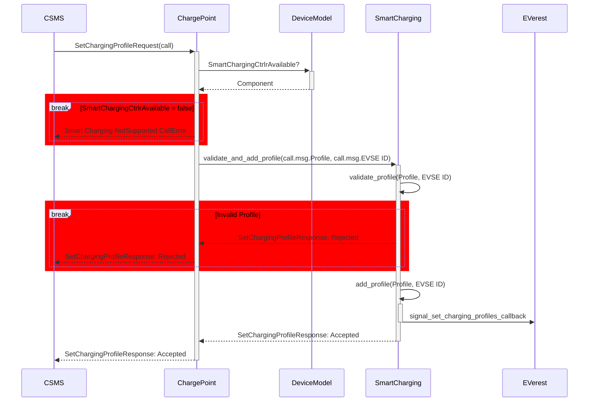
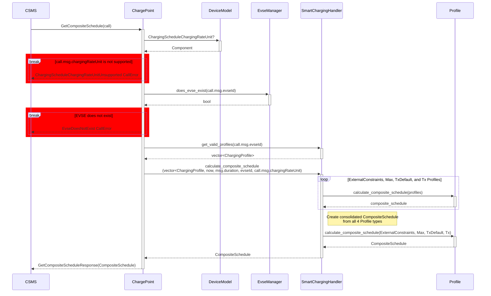
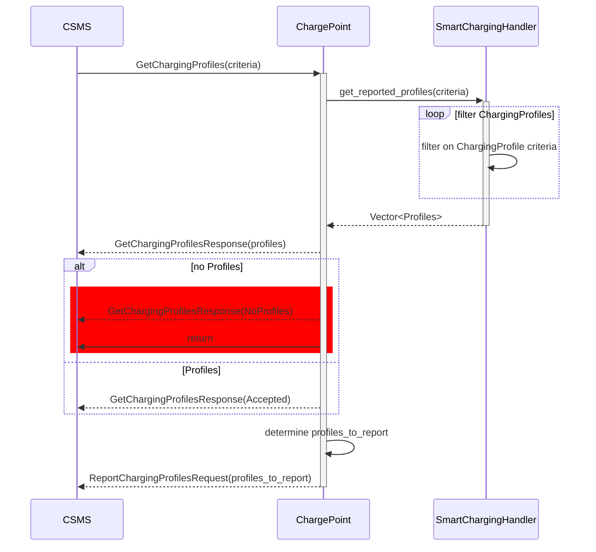
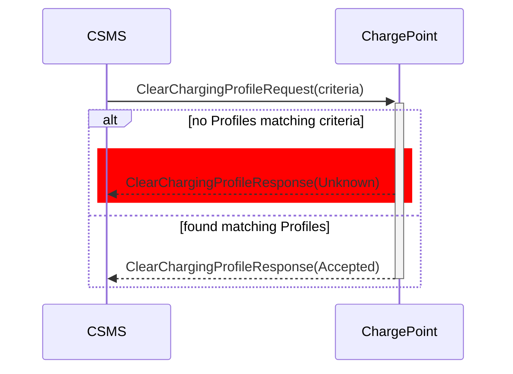

# OCPP 2.0.1: Smart Charging

Work to fully support OCPP 2.0.1 Smart Charging is ongoing. Most functional requirements for General Smart Charging use cases (that is, K01–K10) are now supported. For an up-to-date overview of which features are currently supported, please refer to the [OCPP 2.0.1 Status](doc/ocpp_201_status.md) document.

## Key implemented features include:
- [K01 SetChargingProfile](#K01-SetChargingProfile)
- [K08 Get Composite Schedule](#K08-Get-Composite-Schedule)
- [K09 Get Charging Profiles](#K09-Get-Charging-Profiles)
- [K10 Clear Charging Profile](#K10-Clear-Charging-Profile)

-----

### K01 SetChargingProfile

Allows the CSMS to influence the charging power or current drawn from a specific EVSE or the
entire Charging Station over a period of time.

Profile validation returns the following errors to the caller when a Profile
is `Rejected`:

- `ChargingProfileFirstStartScheduleIsNotZero`

  The `startPeriod` of the first `chargingSchedulePeriod` needs to be 0.
  [K01.FR.31]

- `ChargingProfileNoChargingSchedulePeriods`

  Happens when the `ChargingProfile` doesn't have any Charging Schedule
  Periods.

- `ChargingScheduleChargingRateUnitUnsupported`

  Happens when a chargingRateUnit is passed in that is not configured in the
  `ChargingScheduleChargingRateUnit`. [K01.FR.26]

- `ChargingSchedulePeriodInvalidPhaseToUse`

  Happens when an invalid `phaseToUse` is passed in.
  
  [K01.FR.19] [K01.FR.48]

- `ChargingSchedulePeriodPhaseToUseACPhaseSwitchingUnsupported`

  Happens when phaseToUse is passed in and the EVSE does not have
  `ACPhaseSwitchingSupported` defined and set to true.
  [K01.FR.20] [K01.FR.48]

- `ChargingSchedulePeriodsOutOfOrder`

  `ChargingSchedulePeriod.startPeriod` elements need to be in increasing
  values. [K01.FR.35]

- `ChargingStationMaxProfileCannotBeRelative`

  Happens when a `ChargingStationMaxProfile.chargingProfileKind` is set to
  `Relative`. [K01.FR.38]

- `ChargingStationMaxProfileEvseIdGreaterThanZero`  

  Happens when a `ChargingStationMaxProfile` is attempted to be set with an
  EvseID isn't `0`. [K01.FR.03]

- `ChargingProfileMissingRequiredStartSchedule`

  Happens when an `Absolute` or `Recurring` `ChargingProfile` doesn't have
  a `startSchedule`. [K01.FR.40]

- `ChargingProfileExtraneousStartSchedule`

   Happens when a Relative `ChargingProfile` has a `startSchedule`.
   [K01.FR.41]

- `EvseDoesNotExist`

  Happens when the `evseId`of a `SetChargingProfileRequest` does not exist.
  [K01.FR.28]

- `ExistingChargingStationExternalConstraints`
  
  Happens when a `SetChargingProfileRequest` Profile has a purpose of
  `ChargingStationExternalConstraints` and one already exists with the same
  `ChargingProfile.id` exists. [K01.FR.05]

- `InvalidProfileType`

  Happens when a `ChargingStationMaxProfile` is attempted to be set with a
  `ChargingProfile` that isn't a `ChargingStationMaxProfile`.

- `TxProfileEvseHasNoActiveTransaction`

  Happens when a `SetChargingProfileRequest` with a `TxProfile` is submitted
  and there is no transaction active on the specified EVSE. [K01.FR.09]

- `TxProfileEvseIdNotGreaterThanZero`
  
  `TxProfile` needs to have an `evseId` greater than 0. [K01.FR.16]

- `TxProfileMissingTransactionId`
  
  A `transactionId` is required for  `SetChargingProfileRequest`s with a
  `TxProfile` in order to match the profile to a specific transation. [K01.FR.03]

- `TxProfileTransactionNotOnEvse`
  
  Happens when the provided `transactionId` is not known. [K01.FR.33]

- `TxProfileConflictingStackLevel`

  Happens when a `TxProfile` has a `stackLevel` and `transactionId`
  combination already exists in a `TxProfile` with a different id in
  order to ensure that no two charging profiles with same stack level and
  purpose can be valid at the same time. [K01.FR.39]

-----

### K08 Get Composite Schedule

The CSMS requests the Charging Station to report the Composite Charging
Schedule, as calculated by the Charging Station for a specific point of
time, and may change over time due to external causes such as local
balancing based on grid connection capacity and EVSE availablity.

The Composite Schedule is the result of result of merging the time periods
set in the `ChargingStationMaxProfile`, `ChargingStationExternalConstraints`,
`TxDefaultProfile` and `TxProfile` type profiles.

-----

### K09 Get Charging Profiles

Returns to the CSMS the Charging Schedules/limits installed on a Charging Station based on the 
passed in criteria.

-----

### K10 Clear Charging Profile

Clears Charging Profiles installed on a Charging Station based on the
passed in criteria.

