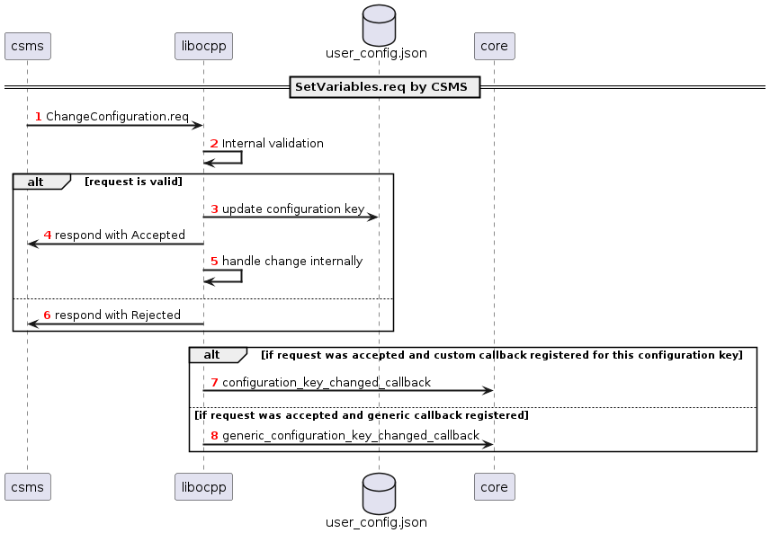

# Access and control of variables and configuration keys

Libocpp provides an API to access and control variables and configuration keys for OCPP1.6 and OCPP2.0.1. The term **configuration keys** is used in connection with the OCPP1.6 specification and the term **variables** is used in connection with the OCPP2.0.1 specification.

The interfaces and implementations for these operations differ between OCPP1.6 and OCPP2.0.1 in this library. This section provides an overview of the integration and mechanisms used for the different protocol versions.

Note that almost all standardized OCPP1.6 configuration keys configure the control flow within the libocpp library itself. This is very different for OCPP2.0.1, where the device model includes all kinds of different telemetry and configuration data of physical and logical components of a charging station. 

## OCPP1.6

The OCPP1.6 specification distributes standardized configuration keys into the feature profiles that it defines. This design is also applied by libocpp. Libocpp uses a JSON config to load the configuration keys into memory at startup. Example configs are located within [here](../../config/v16/).

### Getting variables

Configuration keys can be requested by the CSMS using a `GetConfiguration.req` or by the libocpp consumer using the `get_configuration_key` function of the `v16/charge_point.hpp`.

### Setting variables

The following sequence diagram shows how libocpp handles an incoming ChangeConfiguration.req message by the CSMS:

If the CSMS uses a `ChangeConfiguration.req` to change a configuration key, libocpp validates the request and if the request is valid it writes the updated configuration key into a `user_config.json`. This user config serves as a persistent overlay of the original config and is patched on top of the original config at startup.

If a `ChangeConfiguration.req` could be applied successfully, libocpp uses two callback mechanism to notify the consumer application about the change. The consumer can opt to register a callback for a single configuration key. This callback is executed if this configuration key is changed. The other or additional option is to register a generic callback that is executed if no specific callback is registered for the changed configuration key.

The following sequence diagram shows how libocpp handles a request of the consumer to change a custom configuration key.

The libocpp API for OCPP1.6 only allows to set custom configuration keys. It does not allow to set any of the standardized configuration keys, since all of them are internally managed. Except for this the sequence is similar to the mechanism described previously.

## OCPP2.0.1

Libocpp applies the design and data structures of the device model for Component, Variables, VariableCharacteristics, VariableAttributes and VariableMonitors that is described in part 1 Architecture & Topology of the OCPP2.0.1 specification.

The following simplified UML diagram provides an overview of the relationship between the relevant classes:

### Device Model Integration

The ChargePoint class contains a reference to the DeviceModel. This implementation is within libocpp. This allows to access the device model structure and to do sanity checks  and validations (e.g. by using the VariableCharacteristics) before requesting operations at the actual DeviceModelStorage. Libocpp currently provides an example implementation of the DeviceModelStorage (DeviceModelStorageSqlite) but it can also be provided externally, to allow the usage of different storage achitectures and designs. If provided externally, the implementation needs to provide an implementation for the interface defined within the [DevideModelStroage](../../include/ocpp/v201/device_model_storage.hpp).

### Getting variables

Variables can be requested by the CSMS using a `GetVariables.req` or using the `get_variables` function of the `v201/charge_point.hpp`.

### Setting variables

The following sections describe how libocpp manages requests to set variable values in the device model.

A `SetVariables.req` initiated from the CSMS can contain requests for multiple variables at the same time. For each of the requests libocpp validates if the requests can be validated logically (e.g. NetworkConfigurationPriority is invalid) and using the VariableCharacteristics (e.g. value invalid for datatype, value exceeds defined maxLimit, etc.). In case the validation is successful, libocpp uses the device model reference to request to set the value of the variable. The response for each individual request is sent back in the `SetVariables.conf`.

After the `SetVariables.conf` message was sent to the CSMS, each successful request to change a value of a variable is processed internally (e.g. to update the HeartbeatInterval timer) and the variable_changed_callback is executed to notify the libocpp consumer application about the change. 

If the libocpp consumer application attempts to set a variable using the set_variables function, the flow is almost equal to if the CSMS is using a `SetVariables.req`.

